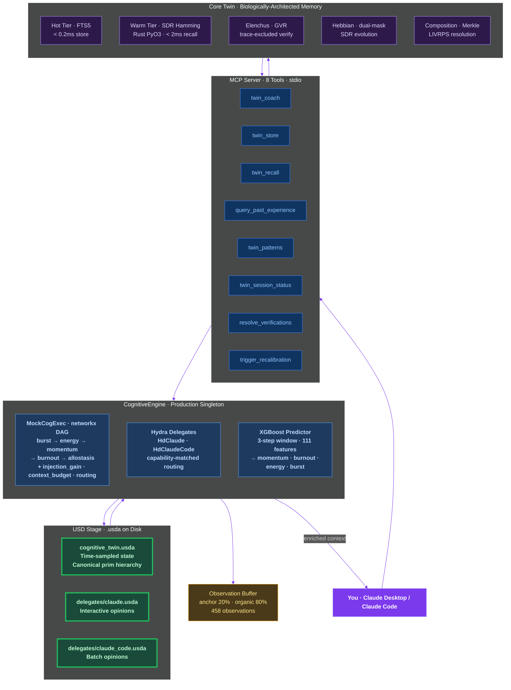
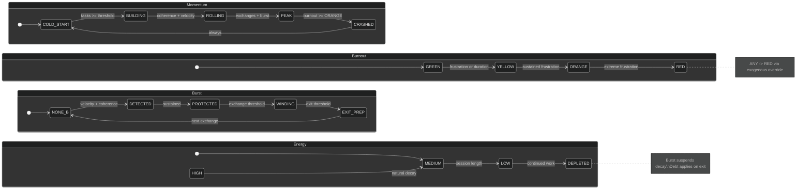
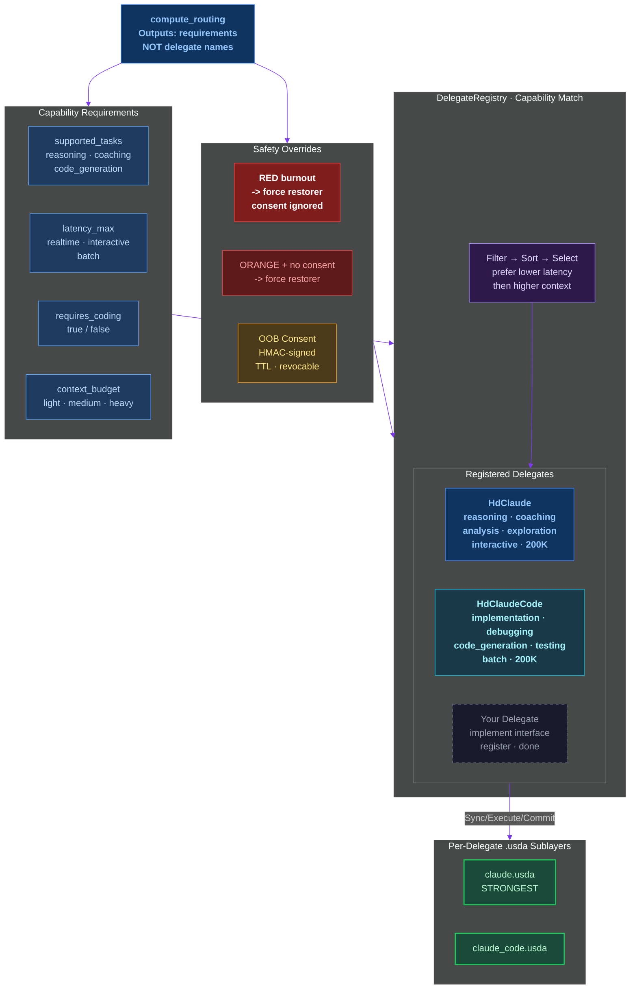
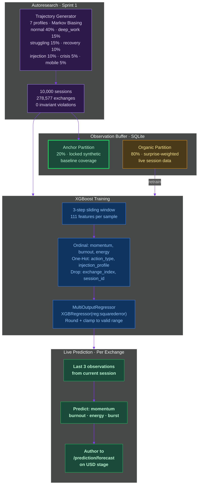

# Cognitive Twin

A biologically-architected AI memory system that models how you think — not what you said. It sits between you and any AI, tracking your cognitive state across sessions: momentum, energy, burnout, burst patterns, allostatic load. The AI doesn't just remember your words — it understands your rhythm. Every exchange evaluates a computation DAG against a real USD stage, routes to capability-matched delegates, emits observations, and predicts your next cognitive state. The intelligence lives in the relationship, not in either party alone.

**Patent Pending.** Three patents filed covering USD cognitive state composition, digital injection framework, and predictive cognitive modeling.

---

## Status

```
PRODUCTION LIVE — Cognitive Twin v3.3.1
250 sprint tests · 890 core tests · 41 Rust tests · All passing
458 organic observations collected
5 sprints shipped · Real .usda on disk · Predictions flowing
```

| Sprint | Tests | What Shipped |
|--------|-------|-------------|
| **S1** State Machine | 84 | Pydantic schemas, MockCogExec DAG (networkx), 7 pure computation functions, 26-invariant validator, 10K synthetic trajectories via Profile-Driven Markov Biasing, XGBoost predictor (100% per-field accuracy), Bridge integration |
| **S2** OpenExec | -- | USD 26.03 built from source with `PXR_BUILD_EXEC=ON`. C++ Exec libraries compile. **Circuit-breaker triggered:** zero Python bindings in v26.03 source. MockCogExec continues to serve. |
| **S3** Hydra Delegates | 85 | HdCognitiveDelegate ABC, DelegateRegistry (capability matching), HdClaude + HdClaudeCode, compute_routing (requirements not names), OOB consent tokens (HMAC-signed, TTL), sublayer-per-delegate concurrency, CognitiveEngine singleton, 20-exchange e2e |
| **S4** Real USD | 59 | CognitiveStage wrapping `pxr.Usd.Stage`, stage_factory toggle, `.usda` files on disk with time-sampled CognitiveObservation, delegate sublayer `.usda` files, backend parity verified (mock = real USD) |
| **S5** Production | 22 | Graceful degradation (independent failure isolation), health check endpoint, kill switches (`ENGINE_ENABLED`, `USE_REAL_USD`, `OBSERVATION_LOGGING`, `PREDICTION_ENABLED`), first session verified, production docs |

---

## Tech Stack

- **USD 26.03** — Cognitive state stored in real `.usda` files. Time-sampled. Human-readable. Git-trackable. Sublayer composition via LIVRPS.
- **OpenExec** — C++ libs built, Python bindings deferred (Pixar hasn't shipped them yet). Architecture is OpenExec-native; implementation catches up later.
- **Hydra Delegates** — The `Hd` prefix is a naming convention, not an import. Pure Python. Any LLM implements the interface, registers, done.
- **XGBoost** — MultiOutputRegressor predicting momentum, burnout, energy, burst from 111-feature sliding window. Trained on 10K synthetic trajectories (278K exchanges).
- **Python 3.12** (USD) / **3.14** (project) — Dual venv. Real USD on 3.12, graceful mock fallback on 3.14.
- **Rust** — Hippocampus crate via PyO3. 1-bit SDR encoding, XOR popcount kNN, lazy decay. Sub-2ms recall.
- **MCP** — 8 tools over stdio. Works with Claude Desktop, Claude Code, any MCP client.

---

## Architecture

### System Layers



### Exchange Loop

Every MCP tool call flows through this 7-step pipeline:

```mermaid
%%{init: {'theme': 'dark', 'themeVariables': {'primaryColor': '#1a1a2e', 'primaryTextColor': '#e0e0e0', 'primaryBorderColor': '#7c3aed', 'lineColor': '#7c3aed'}}}%%
graph LR
    CALL["MCP Tool Call"]:::input

    subgraph PIPELINE["CognitiveEngine · Per-Exchange Pipeline"]
        direction LR
        S1["1 · Author\nBuild observation\nfrom tool context"]:::step
        S2["2 · Evaluate\nDAG: burst → energy\n→ momentum → burnout\n→ allostasis"]:::step
        S3["3 · Route\ncompute_routing →\ncapability requirements"]:::step
        S4["4 · Delegate\nSync → Execute\n→ CommitResources\nto sublayer"]:::step
        S5["5 · Observe\nEmit to buffer\nanchor/organic split"]:::step
        S6["6 · Predict\nXGBoost forecast\nauthor to /prediction"]:::step
        S7["7 · Save\n.usda to disk\ngraceful on failure"]:::step
        S1 --> S2 --> S3 --> S4 --> S5 --> S6 --> S7
    end

    RESPONSE["Enriched Response\ncognitive_context\ndelegate_id · expert\nprediction"]:::output

    CALL --> PIPELINE --> RESPONSE

    classDef input fill:#7c3aed,stroke:#a78bfa,color:#fff,font-weight:bold
    classDef step fill:#1e3a5f,stroke:#60a5fa,color:#bfdbfe
    classDef output fill:#22c55e,stroke:#4ade80,color:#fff,font-weight:bold
```



### Cognitive State Machines

Five state machines evaluated via topologically-sorted DAG on every exchange:



### Hydra Delegate Pattern

The DAG outputs what's needed. The registry selects who fulfills it. The DAG never names a specific LLM.



### Prediction Pipeline

From synthetic autoresearch to live organic observations:



---

## Graceful Degradation

Every component fails independently. The MCP server never crashes.

| Component Failure | Fallback | Logged |
|-------------------|----------|--------|
| USD import fails | MockUsdStage (dict) | WARNING |
| Model file missing | Prediction disabled | WARNING |
| DB locked | Memory queue (max 100) | WARNING |
| DAG evaluation fails | Default computed values | ERROR |
| Delegate cycle fails | Empty context returned | ERROR |
| Stage save fails | Queued for next exchange | WARNING |
| Engine disabled | Pre-Sprint 3 MCP behavior | -- |

---

## Project Structure

```
src/                               Cognitive State Machine + Production Engine
├── cognitive_engine.py            Production singleton: DAG → route → delegate → observe → predict
├── cognitive_stage.py             Real pxr.Usd.Stage wrapper (.usda on disk)
├── mock_usd_stage.py              Dict-based fallback stage
├── stage_factory.py               Backend toggle: USE_REAL_USD
├── mock_cogexec.py                networkx DAG evaluator (topological sort)
├── schemas.py                     Pydantic IntEnum ordinals + CognitiveObservation
├── delegate_base.py               HdCognitiveDelegate ABC (Hydra pattern)
├── delegate_registry.py           Capability-matching selection
├── delegate_claude.py             Interactive reasoning delegate
├── delegate_claude_code.py        Implementation/code delegate
├── consent.py                     OOB consent tokens (HMAC, TTL, revocable)
├── engine_config.py               Kill switches + paths
├── usd_bootstrap.py               USD 26.03 sys.path setup
├── computations/                  Pure functions (no internal counters)
│   ├── compute_momentum.py        CRASHED→COLD_START→BUILDING→ROLLING→PEAK
│   ├── compute_burnout.py         GREEN→YELLOW→ORANGE→RED + exogenous override
│   ├── compute_energy.py          Adrenaline masking, RED degradation, exercise recovery
│   ├── compute_injection_gain.py  Anchor = 1.0 ALWAYS (structural immunity)
│   ├── compute_context_budget.py  Hysteresis: promote >4.2x, demote <3.8x
│   ├── compute_burst.py           5-phase hyperfocus lifecycle
│   ├── compute_allostasis.py      6-weight composite + trend detection
│   └── compute_routing.py         Capability requirements (NOT delegate names)
├── trajectory_generator.py        10K sessions via Profile-Driven Markov Biasing
├── validator.py                   26 invariants (INV-01 to INV-26)
├── train_predictor.py             XGBoost MultiOutputRegressor
├── predict.py                     3-step window inference
├── bridge.py                      Exchange loop coordinator (simulation)
└── observation_buffer.py          SQLite priority queue (anchor 20% / organic 80%)

python/cognitive_twin/             Core Twin: MCP server + biologically-architected memory
├── mcp_server.py                  8 MCP tools over stdio
├── brainstem/                     Lossless translation (14 adapter files)
├── elenchus/                      Verification engine (GVR, trace-excluded)
├── elenchus_v8/                   Deferred verification (Actor-side)
├── composition/                   Merkle stages, LIVRPS resolution
├── hebbian/                       Dual-mask SDR evolution, reconstruction
├── hot_store/                     L1 Hot Tier (FTS5, zero-encoding)
├── modulation/                    Allostatic load, gain, burst detection
├── motor/                         Basal Ganglia gate (inhibit-default)
├── inquiry/                       DMN (apophenia guard, sincerity gate)
├── coach/                         System prompt projection
├── encoder/                       ONNX BGE + LSH → 2048-bit SDR
├── trust/                         Continuous [0,1] trust ledger
├── intake/                        Neuropsych-informed cognitive profile
├── skills/                        Incremental competence tracking
├── session/                       Session lifecycle management
└── usd_lite/                      17 prim dataclasses, .usda serialization

crates/hippocampus/                Rust hot path (SDR, XOR search, lazy decay, apoptosis)

data/stages/                       Real .usda files (your cognitive state)
├── cognitive_twin.usda            Root stage with time-sampled observations
└── delegates/                     Per-delegate sublayers
```

---

## Quick Start

```bash
git clone <repo-url> && cd cognitive-twin
python -m venv .venv && source .venv/bin/activate
pip install -e .
pip install pydantic networkx xgboost scikit-learn joblib

# Health check
python scripts/health_check.py

# First session (10-exchange simulation)
python scripts/first_session.py
```

Environment variables:
```bash
ENGINE_ENABLED=1         # Master kill switch
USE_REAL_USD=1           # Real pxr.Usd.Stage (requires Python 3.12)
OBSERVATION_LOGGING=1    # Emit observations per exchange
PREDICTION_ENABLED=1     # XGBoost predictions
```

---

## The 33 Rules

The architecture is constrained by 33 inviolable rules covering biological fidelity (0W idle, 1-bit SDRs, lazy decay), verification integrity (trace exclusion, max 3 GVR cycles, verified-only consolidation), inquiry safeguards (apophenia guard, sincerity gate, rupture & repair), motor safety (inhibition default, one action at a time, RED kills everything), and Hebbian constraints (Merkle isolation, dual masks not XOR, homeostatic plasticity). These aren't guidelines — they're structural constraints enforced by 1,140+ tests. See `CLAUDE.md` for the full specification.

---

## Philosophy

The Cognitive Twin is a self-evolving dialogue between a human and their externalized cognition, where both participants transform through the interaction, and the intelligence lives in the relationship — not in either party alone.

You own your mind. AI models just rent access to it.

---

## Patent Pending

Three patent applications filed covering:
1. **USD-native cognitive state composition** — LIVRPS-ordered sublayer resolution for cognitive modeling
2. **Digital injection framework** — pharmacokinetic-modeled AI behavior modulation with anchor immunity
3. **Predictive cognitive modeling** — XGBoost state prediction from synthetic autoresearch trajectories

Proprietary. Copyright Joseph O. Ibrahim, 2026.
