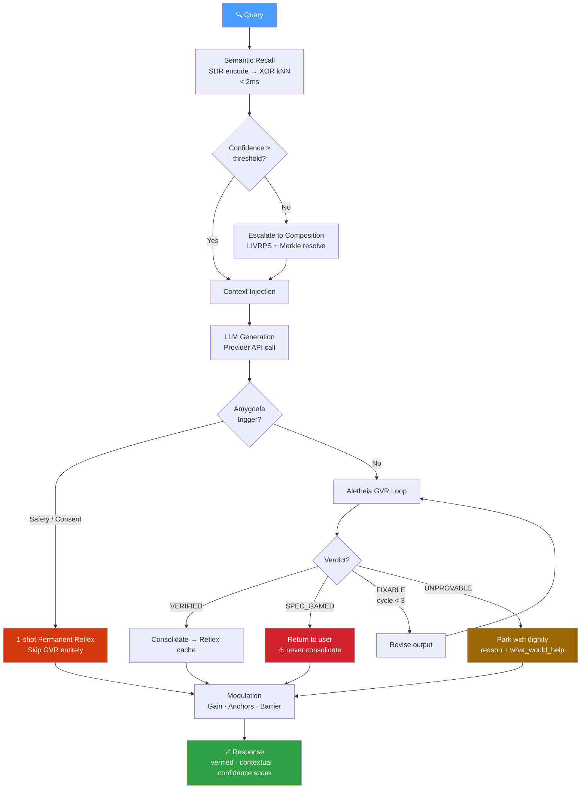
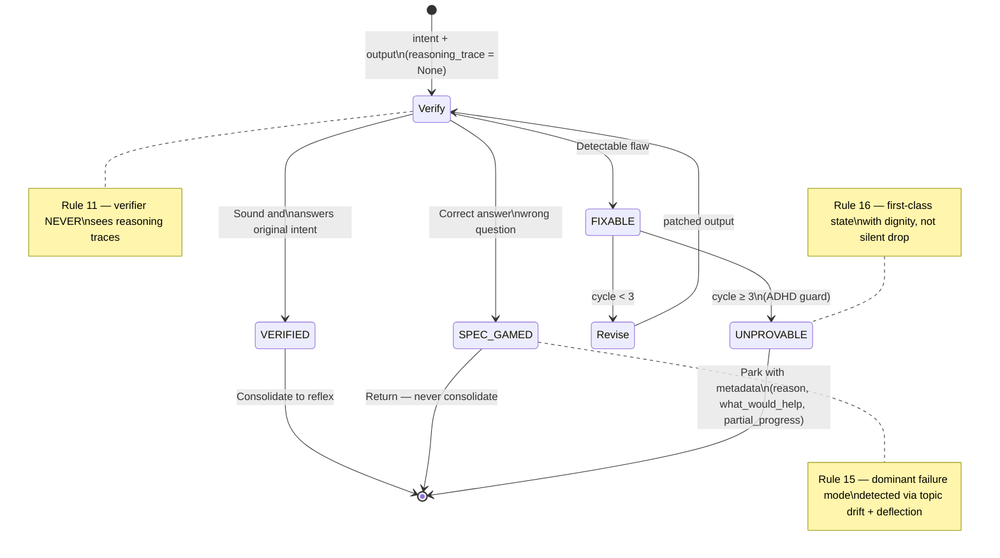
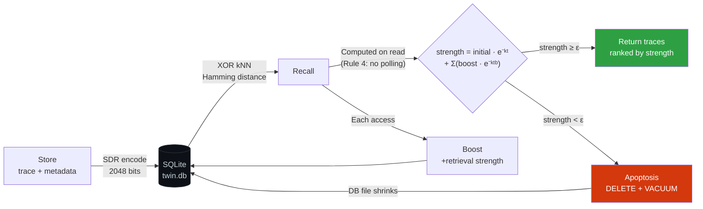
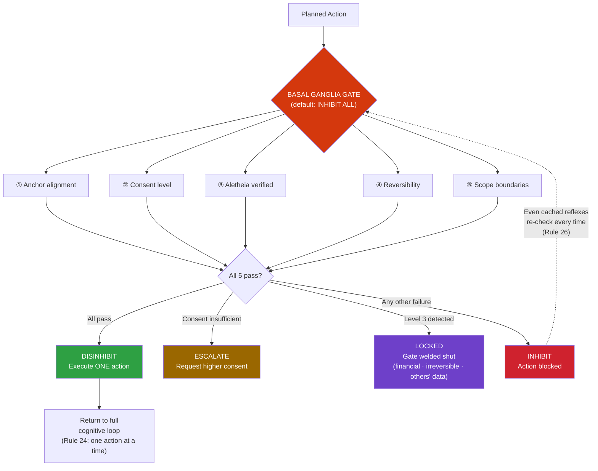
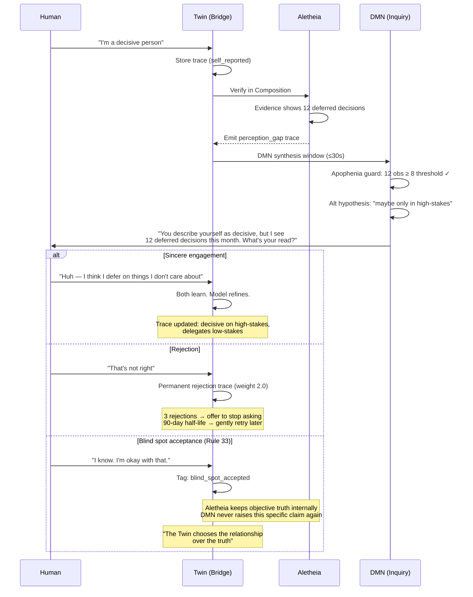

# Cognitive Twin

A persistent cognitive layer that sits between you and any LLM, modeling not what you know — but how you think.

## The Problem

LLM conversations are stateless. Every session starts from zero. Your context, your patterns of thought, your evolving understanding — all evaporated the moment the window closes. Current "memory" solutions bolt on vector databases that store what you said, not how you reason. The Cognitive Twin inverts this: it builds a living model of your cognition that any LLM can consult, verify against, and evolve through.

## How It Works

```
                          COGNITIVE TWIN v6.0-MOTOR
                          =========================

  You ──► CLI (Click, 29 commands)
           │
           ▼
  ┌─────────────────────────────────────────────────────────────────┐
  │  BRIDGE (Corpus Callosum + Amygdala)                           │
  │                                                                │
  │  query ──► Semantic Recall ──► Context Injection ──► Provider  │
  │               │                                        │       │
  │               │                              ┌─────────┘       │
  │               ▼                              ▼                 │
  │  ┌──────────────────────┐     ┌──────────────────────────┐     │
  │  │  ASSOCIATION ENGINE  │     │  ALETHEIA VERIFICATION   │     │
  │  │  (Right Hemisphere)  │     │  (GVR Loop, max 3)       │     │
  │  │                      │     │                          │     │
  │  │  Rust (PyO3)         │     │  Verify ──► Revise ──►┐  │     │
  │  │  2048-bit SDR encode │     │    ▲                  │  │     │
  │  │  XOR + popcount kNN  │     │    └──────────────────┘  │     │
  │  │  Lazy decay on read  │     │                          │     │
  │  │  <2ms hot recall     │     │  Spec-gaming detection   │     │
  │  └──────────────────────┘     │  Trace-excluded verify   │     │
  │               │               │  UNPROVABLE with dignity │     │
  │               │               └──────────────────────────┘     │
  │               ▼                              │                 │
  │  ┌──────────────────────┐                    ▼                 │
  │  │  COMPOSITION ENGINE  │          ┌───────────────────┐       │
  │  │  (Left Hemisphere)   │          │  MOTOR CORTEX     │       │
  │  │                      │          │                   │       │
  │  │  Merkle stages       │          │  Premotor plan    │       │
  │  │  LIVRPS resolution   │          │  Basal Ganglia    │       │
  │  │  Conflict detection  │          │  (5-check gate,   │       │
  │  │  Append-only audit   │          │   inhibit-default)│       │
  │  └──────────────────────┘          │  ONE action/cycle │       │
  │                                    └───────────────────┘       │
  │  ┌──────────────────────┐     ┌──────────────────────────┐     │
  │  │  MODULATION LAYER    │     │  INQUIRY ENGINE (DMN)    │     │
  │  │  (Brainstem)         │     │                          │     │
  │  │                      │     │  Pattern detection       │     │
  │  │  Allostatic load     │     │  Apophenia guard         │     │
  │  │  Gain + anchors      │     │  Sincerity gate          │     │
  │  │  Blood-Brain Barrier │     │  Rupture & repair        │     │
  │  │  Pattern detection   │     │  Crystallization         │     │
  │  └──────────────────────┘     │  DMN teardown (<50ms)    │     │
  │                               └──────────────────────────┘     │
  └─────────────────────────────────────────────────────────────────┘
           │
           ▼
  Response (verified, contextual, with confidence score)
```

The system is event-driven and socket-activated. It idles at 0 watts. No polling, no `sleep()`, no background threads. The daemon wakes on command, does its work, and exits.

### Generation Pipeline

How a query flows through the system end-to-end:



### Aletheia Verification States

The Generate-Verify-Revise loop and its four terminal states:



### Trace Lifecycle

From storage through decay to apoptosis — the database actually shrinks:



### Motor Cortex Decision Gate

Inhibition-default: every action must pass ALL five checks or it's blocked.



### Co-Evolution Spiral

How the Twin and the human transform each other through interaction:



## Key Design Decisions

**1-bit SDR bitvectors, not float embeddings.** Memory search uses 2048-bit Sparse Distributed Representations. Hamming distance via XOR + popcount. No cosine similarity, no float32 storage. The Rust hot path processes these at <2ms for recall.

**Dual encoding paths.** The Rust encoder uses n-gram hashing for lexical SDRs. The Python encoder uses BGE-small-en-v1.5 sentence embeddings projected through LSH into binary vectors. Both produce the same 2048-bit format. The system falls back gracefully between them.

**Lazy decay, not polling.** Trace strength is computed on retrieval: `strength = initial * e^(-lambda * dt) + sum(boosts)`. No background jobs. Traces below epsilon are physically deleted (apoptosis) with `VACUUM` — the database actually shrinks.

**Aletheia verification pipeline.** Every LLM response runs through Generate-Verify-Revise. Max 3 cycles (ADHD guard). The verifier never sees reasoning traces (structural constraint). Spec-gaming detection catches correct answers to wrong questions. Unresolvable outputs are parked as UNPROVABLE with full metadata — not silently dropped.

**Inhibition-default motor cortex.** The Basal Ganglia gate defaults to INHIBIT ALL. Every action requires all five checks (anchor, consent, verification, reversibility, scope). Financial transactions and irreversible deletions are structurally locked. RED state halts everything.

**Session-aware allostatic load.** Token velocity and prompt frequency track cognitive fatigue across sessions. DEPLETED state downgrades motor consent levels. The system protects you from yourself when you're running hot.

**DMN inquiry engine.** Pattern detection surfaces co-evolutionary inquiries. Evidence-gated (minimum 5-25 observations by depth). A sincerity gate classifies your responses before acting on them. Rejection is a permanent, non-decaying trace. Three rejections and it offers to stop. The system learns from how you push back, not just what you say.

## Quick Start

```bash
git clone <repo-url> && cd cognitive-twin

# Python environment
python -m venv .venv && source .venv/bin/activate   # or .venv\Scripts\activate on Windows
pip install -e .
pip install anthropic sentence-transformers

# Build Rust hot path (optional — system falls back to Python encoding)
pip install maturin
maturin develop -r

# Download the semantic encoder model (~130MB, one-time)
python scripts/setup_semantic_encoder.py

# Set your LLM provider key
export ANTHROPIC_API_KEY="sk-ant-..."

# First question
python -m cognitive_twin.cli.main ask "What patterns do you notice in my recent traces?"
```

## Project Structure

```
python/cognitive_twin/
├── aletheia/          Verification engine — GVR loop, spec-gaming, trace exclusion
├── bridge/            Generation pipeline — recall → context → LLM → verify → respond
├── cli/               Click CLI — 29 commands, human + JSON output
│   └── commands/      Individual command implementations
├── composition/       Left hemisphere — Merkle stages, LIVRPS resolution, audit trail
├── daemon/            Socket-activated daemon — router, config, lifecycle, connection pool
├── encoder/           Dual-path encoding — semantic (BGE+LSH) and lexical (Rust n-gram)
├── inquiry/           Default Mode Network — pattern surfacing, safeguards, co-evolution
├── modulation/        Brainstem — allostatic load, gain, barrier, pattern detection
├── motor/             Motor cortex — premotor planning, Basal Ganglia gate, executor
├── provider/          LLM abstraction — Protocol-based, Claude and OpenAI adapters
└── session/           Session lifecycle — SQLite-backed, history, expiration

crates/hippocampus/    Rust hot path — SDR encode, XOR search, lazy decay, apoptosis
config/                Barrier schema, verification depth, default profile
scripts/               Daemon start/stop, model download
tests/                 17 test modules across all subsystems
```

## Testing

**404 tests** (363 Python + 41 Rust), all passing.

```bash
pytest tests/ -v                   # Python tests (363)
cargo test -p hippocampus          # Rust tests (41)
pytest tests/test_integration/ -v  # Integration + compliance checks
```

Coverage spans: SDR encoding, hamming search, lazy decay, GVR protocol, Merkle stages, session lifecycle, pattern detection, Basal Ganglia gating, consent levels, connection pooling, CLI commands, daemon lifecycle, provider abstraction, and compliance with all 33 architectural rules.

## Status

**What works:** Full generation pipeline (recall → augment → generate → verify → respond). Semantic and lexical encoding. Session management with allostatic tracking. Pattern detection. Motor cortex with 5-check inhibition gate. Aletheia GVR with spec-gaming detection. DMN inquiry engine with all safeguards. Export/import. 29 CLI commands. Cross-platform daemon lifecycle.

**What's experimental:** The co-evolutionary inquiry loop (DMN) works mechanically but needs extended real-world sessions to tune thresholds. The Rust hot path is feature-complete but the semantic encoder (Python-side BGE+LSH) handles most recall in practice until the Rust module is compiled.

**What's next:** Systemd/launchd socket activation units for true 0W idle. Persistent action plan storage in Composition stages. Multi-session pattern synthesis. Expanded provider support.

## The 33 Rules

The architecture is constrained by 33 inviolable rules covering biological fidelity (0W idle, 1-bit SDRs, lazy decay), verification integrity (trace exclusion, max 3 GVR cycles, verified-only consolidation), inquiry safeguards (apophenia guard, sincerity gate, rupture & repair), and motor safety (inhibition default, one action at a time, RED kills everything). These aren't guidelines — they're structural constraints enforced by tests. See `CLAUDE.md` for the full specification.

## Philosophy

The Cognitive Twin is a self-evolving dialogue between a human and their externalized cognition, where both participants transform through the interaction, and the intelligence lives in the relationship — not in either party alone.

You own your mind. AI models just rent access to it.

## MCP Quick Reference

The Cognitive Twin exposes 5 tools via [Model Context Protocol](https://modelcontextprotocol.io). Works with Claude Desktop, Claude Code, and any MCP-compatible client.

### `twin_store` — Save a memory trace

```
twin_store(message, domain?, tags?)
```

| Param | Type | Required | Example |
|-------|------|----------|---------|
| `message` | string | yes | `"Resolved Python 3.12 path issue by installing mcp into PATH Python"` |
| `domain` | string | no | `"technical"`, `"debugging"`, `"architecture"`, `"decision"` |
| `tags` | string[] | no | `["mcp", "python-path", "resolved"]` |

### `twin_recall` — Semantic search over stored traces

```
twin_recall(query, depth?)
```

| Param | Type | Required | Example |
|-------|------|----------|---------|
| `query` | string | yes | `"Python import issues"` |
| `depth` | `"normal"` \| `"deep"` | no | `"normal"` (top 5) or `"deep"` (top 15) |

Returns matching traces ranked by SDR hamming distance with strength scores and confidence.

### `twin_ask` — Full generation pipeline

```
twin_ask(question)
```

| Param | Type | Required | Example |
|-------|------|----------|---------|
| `question` | string | yes | `"What problems did I hit getting MCP working?"` |

Pipeline: semantic recall → context injection → LLM generation → Aletheia GVR verification → response.

> Requires `ANTHROPIC_API_KEY` in the server environment.

### `twin_patterns` — Detect clusters and escalation

```
twin_patterns()
```

No arguments. Runs all detection algorithms:
- **Recurring themes** — semantic clustering via SDR hamming distance
- **Temporal patterns** — trace co-occurrence within 24h windows
- **Allostatic load** — escalation tracking across sessions

### `twin_session_status` — Active session info

```
twin_session_status()
```

No arguments. Returns active sessions with exchange count, allostatic load, domain, and timing.

### Setup

Add to `claude_desktop_config.json`:

```json
{
  "mcpServers": {
    "cognitive-twin": {
      "command": "cognitive-twin",
      "env": {
        "ANTHROPIC_API_KEY": "sk-ant-..."
      }
    }
  }
}
```

### How It Works

- **Encoder**: BGE embeddings → LSH → 2048-bit Sparse Distributed Representations
- **Search**: XOR + popcount (Hamming distance) — sub-2ms recall
- **Decay**: Lazy (computed on read, not background jobs)
- **Verification**: Aletheia GVR loop (trace-excluded, max 3 cycles)
- **Hot path**: Rust via PyO3 (`hippocampus` crate)

## License

Proprietary. Copyright Joseph O. Ibrahim, 2026.
