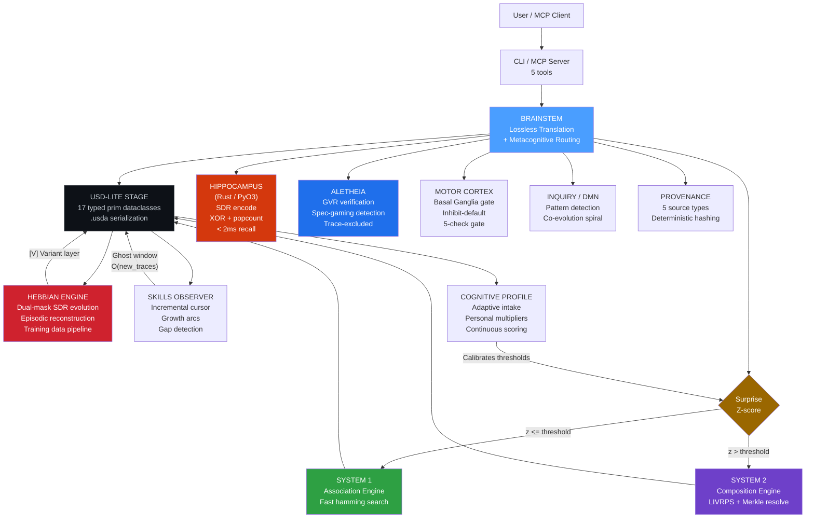
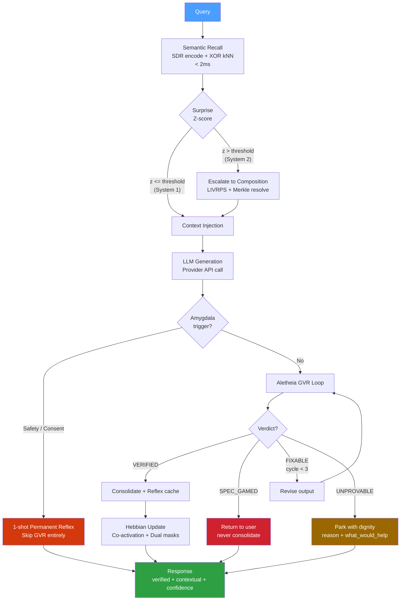
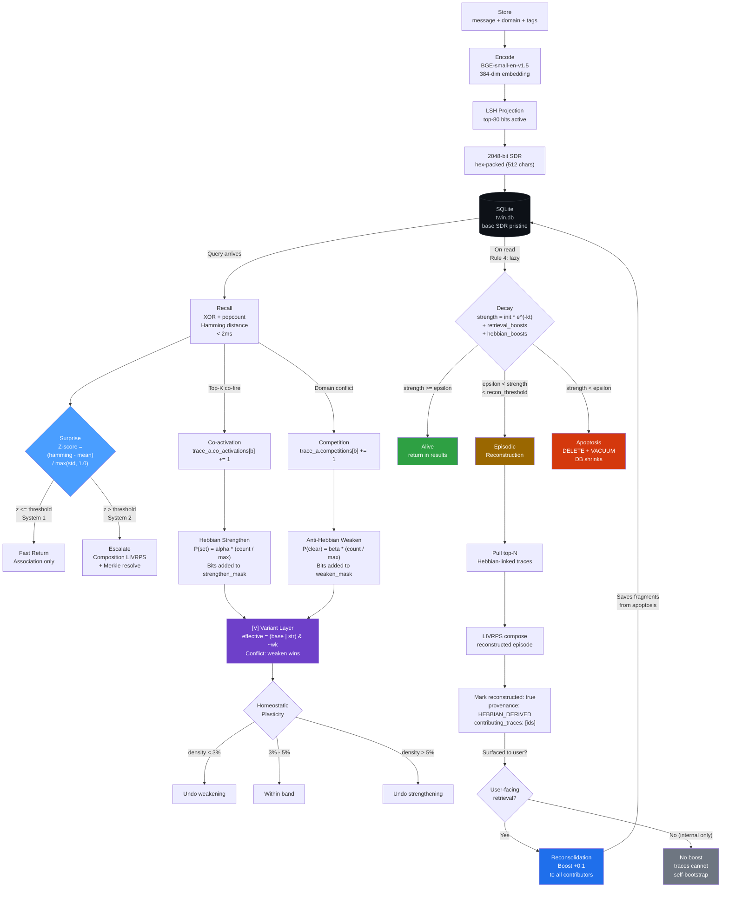
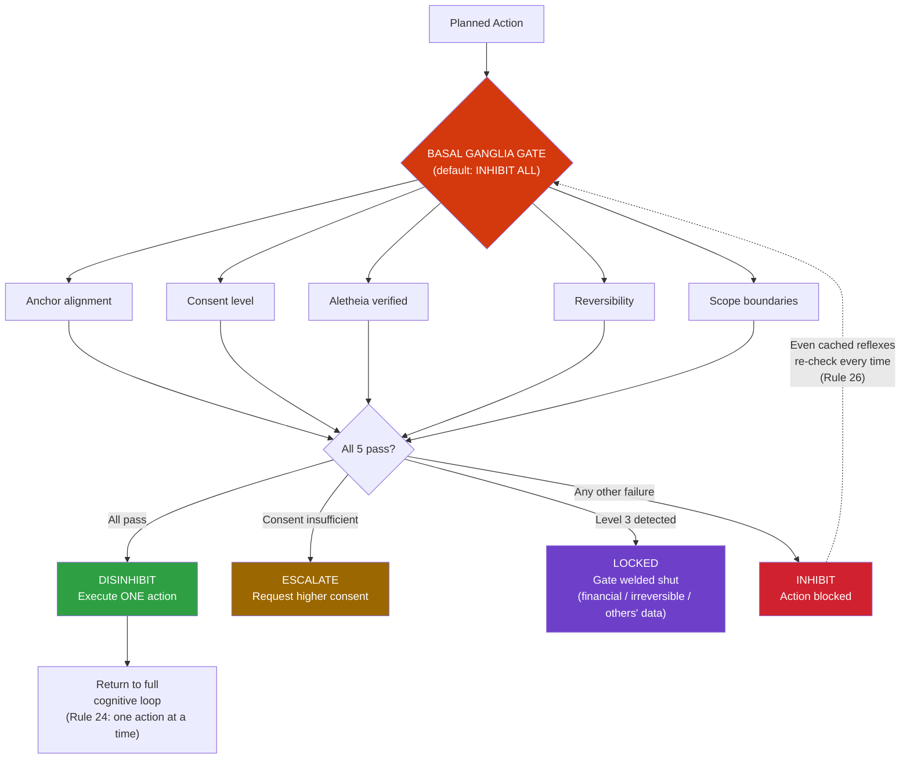
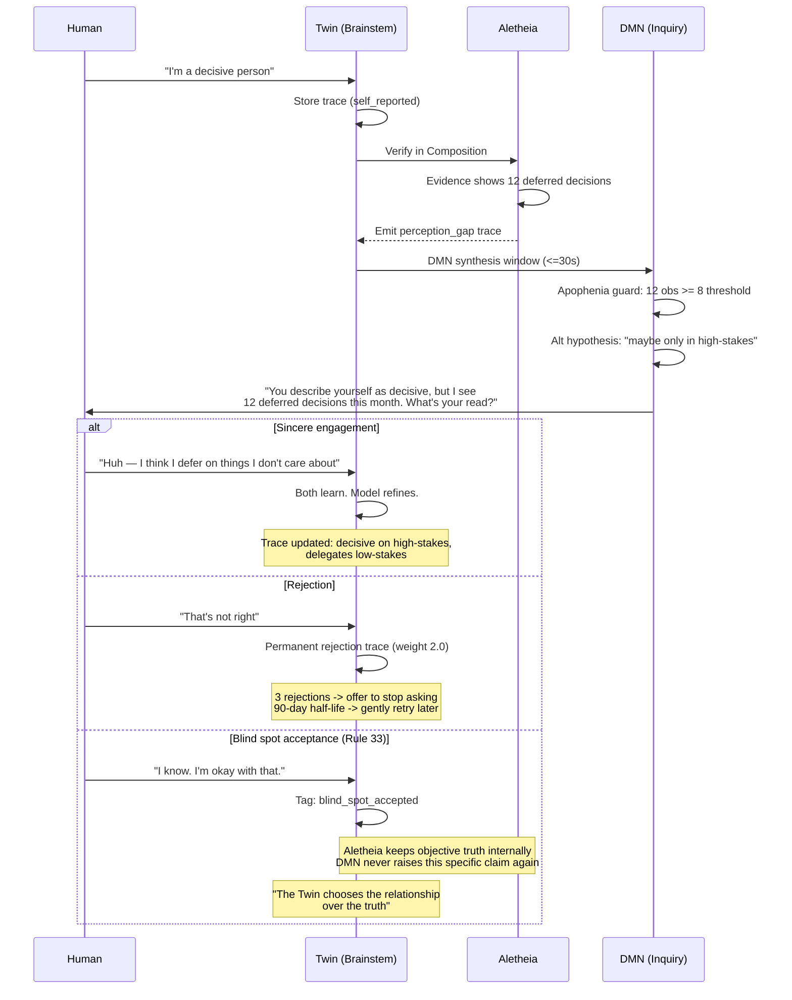
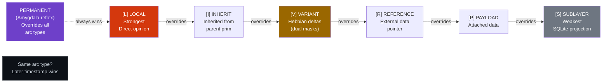

# Cognitive Twin

A persistent cognitive layer that sits between you and any LLM, modeling not what you know — but how you think.

## The Problem

LLM conversations are stateless. Every session starts from zero. Your context, your patterns of thought, your evolving understanding — all evaporated the moment the window closes. Current "memory" solutions bolt on vector databases that store what you said, not how you reason. The Cognitive Twin inverts this: it builds a living model of your cognition that any LLM can consult, verify against, and evolve through.

## How It Works

```
                          COGNITIVE TWIN v7.0
                          ====================

  You ──► CLI (Click) / MCP (5 tools)
           │
           ▼
  ┌─────────────────────────────────────────────────────────────────┐
  │  BRAINSTEM (Lossless Translation + Metacognitive Routing)      │
  │                                                                │
  │  query ──► Semantic Recall ──► Surprise Z-score ──► Route      │
  │               │                    │                            │
  │               │          System 1 (fast)  System 2 (deliberate) │
  │               ▼                    ▼                            │
  │  ┌──────────────────────┐     ┌──────────────────────────┐     │
  │  │  ASSOCIATION ENGINE  │     │  ALETHEIA VERIFICATION   │     │
  │  │  (Right Hemisphere)  │     │  (GVR Loop, max 3)       │     │
  │  │                      │     │                          │     │
  │  │  Rust (PyO3)         │     │  Verify ──► Revise ──►┐  │     │
  │  │  2048-bit SDR encode │     │    ▲                  │  │     │
  │  │  XOR + popcount kNN  │     │    └──────────────────┘  │     │
  │  │  Lazy decay on read  │     │                          │     │
  │  │  <2ms hot recall     │     │  Spec-gaming detection   │     │
  │  └──────────────────────┘     │  Trace-excluded verify   │     │
  │               │               │  UNPROVABLE with dignity │     │
  │               ▼               └──────────────────────────┘     │
  │  ┌──────────────────────┐                    │                 │
  │  │  COMPOSITION ENGINE  │          ┌─────────┴─────────┐       │
  │  │  (Left Hemisphere)   │          │  MOTOR CORTEX     │       │
  │  │                      │          │                   │       │
  │  │  Merkle stages       │          │  Premotor plan    │       │
  │  │  LIVRPS resolution   │          │  Basal Ganglia    │       │
  │  │  Structured          │          │  (5-check gate,   │       │
  │  │    Provenance        │          │   inhibit-default)│       │
  │  └──────────────────────┘          │  ONE action/cycle │       │
  │                                    └───────────────────┘       │
  │  ┌──────────────────────┐     ┌──────────────────────────┐     │
  │  │  HEBBIAN ENGINE      │     │  INQUIRY ENGINE (DMN)    │     │
  │  │                      │     │                          │     │
  │  │  Dual-mask SDR       │     │  Pattern detection       │     │
  │  │    evolution         │     │  Apophenia guard         │     │
  │  │  Episodic context    │     │  Sincerity gate          │     │
  │  │    reconstruction    │     │  Rupture & repair        │     │
  │  │  Homeostatic [3%-5%] │     │  Crystallization         │     │
  │  │  Training data       │     │  DMN teardown (<50ms)    │     │
  │  │    pipeline          │     │                          │     │
  │  └──────────────────────┘     └──────────────────────────┘     │
  │                                                                │
  │  ┌──────────────────────┐     ┌──────────────────────────┐     │
  │  │  USD-LITE CONTAINER  │     │  COGNITIVE PROFILE       │     │
  │  │                      │     │                          │     │
  │  │  17 typed prim       │     │  Adaptive intake         │     │
  │  │    dataclasses       │     │  Continuous [0,1] scoring│     │
  │  │  .usda serialization │     │  Personal baselines      │     │
  │  │  Hex SDR (512 chars) │     │  Skills observer         │     │
  │  └──────────────────────┘     └──────────────────────────┘     │
  └─────────────────────────────────────────────────────────────────┘
           │
           ▼
  Response (verified, contextual, personally calibrated)
```

The system is event-driven and socket-activated. It idles at 0 watts. No polling, no `sleep()`, no background threads. The daemon wakes on command, does its work, and exits.

### Module Hierarchy

The v7.0 architecture as a dependency graph. The Brainstem is the central translation layer — every subsystem reads and writes through it via USD-Lite stages.



### Generation Pipeline

How a query flows through the system end-to-end:



### Aletheia Verification States

The Generate-Verify-Revise loop and its four terminal states:


### Trace Lifecycle

The full journey of a memory trace — from storage through encoding, recall, Hebbian evolution, reconstruction, and eventual apoptosis. The reconsolidation boost creates a feedback loop that saves degraded traces from death when users actually retrieve their reconstructed episodes.



### Motor Cortex Decision Gate

Inhibition-default: every action must pass ALL five checks or it's blocked.



### Co-Evolution Spiral

How the Twin and the human transform each other through interaction:



## Key Design Decisions

**1-bit SDR bitvectors, not float embeddings.** Memory search uses 2048-bit Sparse Distributed Representations. Hamming distance via XOR + popcount. No cosine similarity, no float32 storage. The Rust hot path processes these at <2ms for recall.

**USD-Lite container format.** Every subsystem writes to a shared USD stage with 17 typed prim dataclasses. `.usda` text serialization with proven round-trip fidelity. LIVRPS composition with permanent-prim handling. Float tolerance via `math.isclose()`. SDR arrays packed as 512-char hex strings (not 6KB text arrays).

### LIVRPS Composition Precedence

Pixar's USD composition ordering adapted for brain state. Strongest opinion wins per attribute. Permanent prims (Amygdala reflexes) override everything.



**Brainstem lossless translation.** Each subsystem gets one adapter pair (native to/from USD prims). Round-trip fidelity proven by Hypothesis property-based testing. Z-score surprise metric drives dual-process routing: System 1 (fast hamming search) escalates to System 2 (deliberative LIVRPS) when surprise exceeds the user's personal threshold.

**Dual-mask Hebbian learning (not XOR).** Co-activated traces strengthen shared bits; competing traces weaken them. Separate `strengthen_mask` and `weaken_mask` stored in the [V] Variant USD layer. Formula: `effective_sdr = (base | strengthen) & ~weaken`. Conflict resolution: weaken wins. Base SDR in SQLite stays pristine. Merkle hash computed over base traces only. Homeostatic plasticity clamps activation density to [3%, 5%].

**Episodic context reconstruction.** Degraded traces below the reconstruction threshold are rebuilt from Hebbian-linked co-activations via LIVRPS composition. The apoptosis clamp (`max(apoptosis + 0.05, threshold)`) prevents the race condition where traces die before qualifying for reconstruction. Reconsolidation boost fires only on user-facing retrieval — traces cannot bootstrap their own survival.

**Cognitive profile intake.** An adaptive neuropsych-informed questionnaire calibrates personal thresholds. Continuous [0.0, 1.0] scoring with deterministic linear interpolation. Semantic ceiling detection (not answer length). The Twin works from the first interaction with universal defaults; the intake makes it work *better*.

**Lazy decay, not polling.** Trace strength is computed on retrieval: `strength = initial * e^(-lambda * dt) + sum(boosts) + sum(hebbian_boosts)`. No background jobs. Traces below epsilon are physically deleted (apoptosis) with `VACUUM` — the database actually shrinks.

**Aletheia verification pipeline.** Every LLM response runs through Generate-Verify-Revise. Max 3 cycles (ADHD guard). The verifier never sees reasoning traces (structural constraint). Spec-gaming detection catches correct answers to wrong questions. Unresolvable outputs are parked as UNPROVABLE with full metadata — not silently dropped.

**Inhibition-default motor cortex.** The Basal Ganglia gate defaults to INHIBIT ALL. Every action requires all five checks (anchor, consent, verification, reversibility, scope). Financial transactions and irreversible deletions are structurally locked. RED state halts everything.

**Structured provenance.** Every composition layer carries a typed Provenance dataclass (source_type, origin_timestamp, event_hash, session_id). Five source types: USER_DIRECT, EXTERNAL_REFERENCE, SYSTEM_INFERRED, HEBBIAN_DERIVED, INTAKE_CALIBRATED. Legacy layers receive SYSTEM_INFERRED during migration.

**Aletheia training data pipeline.** Every verification event appends a JSONL row with the full cognitive profile feature vector (not just a hash). O(1) amortized log rotation at 10,000 rows. No reasoning traces (Rule 11). Ready for LoRA fine-tuning of a personalized verification model.

## Quick Start

```bash
git clone <repo-url> && cd cognitive-twin

# Python environment
python -m venv .venv && source .venv/bin/activate   # or .venv\Scripts\activate on Windows
pip install -e .
pip install anthropic sentence-transformers

# Build Rust hot path (optional — system falls back to Python encoding)
pip install maturin
maturin develop -r

# Download the semantic encoder model (~130MB, one-time)
python scripts/setup_semantic_encoder.py

# Set your LLM provider key
export ANTHROPIC_API_KEY="sk-ant-..."

# First question
python -m cognitive_twin.cli.main ask "What patterns do you notice in my recent traces?"
```

## Project Structure

```
python/cognitive_twin/
├── aletheia/          Verification engine — GVR loop, spec-gaming, trace exclusion
├── brainstem/         Lossless translation — adapters, routing, generation pipeline,
│                        amygdala, consolidation, provenance, escalation
├── cli/               Click CLI — human + JSON output
│   └── commands/      Individual command implementations
├── composition/       Left hemisphere — Merkle stages, LIVRPS resolution, audit trail
├── daemon/            Socket-activated daemon — router, config, lifecycle
├── encoder/           Dual-path encoding — semantic (BGE+LSH) and lexical (Rust n-gram)
├── hebbian/           Neuroplasticity — dual-mask SDR evolution, reconstruction,
│                        training data pipeline
├── inquiry/           Default Mode Network — pattern surfacing, safeguards, co-evolution
├── intake/            Cognitive profile — adaptive questionnaire, multiplier derivation
├── modulation/        Brainstem — allostatic load, gain, barrier, pattern detection
├── motor/             Motor cortex — premotor planning, Basal Ganglia gate, executor
├── provider/          LLM abstraction — Protocol-based, Claude and OpenAI adapters
├── session/           Session lifecycle — SQLite-backed, history, expiration
├── skills/            Competence tracking — incremental observer, 4 query patterns
├── usd_lite/          USD container — 17 prim dataclasses, .usda serialization, LIVRPS
└── migrate_v7.py      v6 → v7 migration (bootstraps /Skills from legacy traces)

crates/hippocampus/    Rust hot path — SDR encode, XOR search, lazy decay, apoptosis
config/                Barrier schema, verification depth, default profile
data/                  Runtime data — stages, reflexes, audit, training data
scripts/               Daemon start/stop, model download
tests/                 20 test modules across all subsystems
```

## Testing

**761 tests** (720 Python + 41 Rust), all passing.

```bash
pytest tests/ -v                                  # Full Python suite (720)
cargo test -p hippocampus                         # Rust tests (41)
pytest tests/test_integration/ -v                 # Integration + compliance

# Phase-specific verification
pytest tests/test_usd_lite/ -v                    # USD container format
pytest tests/test_brainstem/ -v                   # Lossless translation + routing
pytest tests/test_skills/ -v                      # Incremental skills observer
pytest tests/test_intake/ -v                      # Cognitive profile intake
pytest tests/test_hebbian/ -v                     # Hebbian + reconstruction + training data
```

Coverage spans: USD serialization round-trip, hex SDR encoding, LIVRPS composition, adapter fidelity (Hypothesis property-based), Z-score surprise routing, Merkle isolation, dual-mask Hebbian correctness, homeostatic stability, episodic reconstruction, apoptosis clamp, reconsolidation boost gating, training data JSONL, O(1) log rotation, cognitive profile continuous scoring, semantic ceiling detection, incremental skills observation, GVR protocol, spec-gaming detection, Basal Ganglia gating, structured provenance, and compliance with all 33 architectural rules.

## Research Alignment

| Research Concept | Implementation | Status |
|---|---|---|
| SSGM temporal decay | Lazy decay with Hebbian boost integration | Extended |
| SSGM pre-consolidation validation | Aletheia trace exclusion (blinded) | Already ahead |
| SSGM provenance | Structured 5-type Provenance dataclass | **New in v7** |
| SSGM fragment reconstruction | Episodic reconstruction via Hebbian + LIVRPS | **New in v7** |
| Titans test-time memorization | Hebbian dual-mask SDR evolution | **New in v7** |
| Titans forgetting gate | Apoptosis (more aggressive, with clamp) | Already ahead |
| Mnemis entropy gating | Z-score surprise metric + dual-process routing | **New in v7** |
| HiMem reconsolidation | Brain-wide LIVRPS + reconsolidation boost | Extended |
| LoCoMo-Plus Level-2 memory | Skills observer + competence tracking | **New in v7** |
| Analog I sovereign refusal | Basal Ganglia inhibition-default gate | Already ahead |
| (No equivalent in literature) | Cognitive Profile intake system | **Original** |

## MCP Quick Reference

The Cognitive Twin exposes 5 tools via [Model Context Protocol](https://modelcontextprotocol.io). Works with Claude Desktop, Claude Code, and any MCP-compatible client.

### `twin_store` — Save a memory trace

```
twin_store(message, domain?, tags?)
```

| Param | Type | Required | Example |
|-------|------|----------|---------|
| `message` | string | yes | `"Resolved Python 3.12 path issue by installing mcp into PATH Python"` |
| `domain` | string | no | `"technical"`, `"debugging"`, `"architecture"`, `"decision"` |
| `tags` | string[] | no | `["mcp", "python-path", "resolved"]` |

### `twin_recall` — Semantic search over stored traces

```
twin_recall(query, depth?)
```

| Param | Type | Required | Example |
|-------|------|----------|---------|
| `query` | string | yes | `"Python import issues"` |
| `depth` | `"normal"` \| `"deep"` | no | `"normal"` (top 5) or `"deep"` (top 15) |

Returns matching traces ranked by SDR hamming distance with strength scores and confidence.

### `twin_ask` — Full generation pipeline

```
twin_ask(question)
```

| Param | Type | Required | Example |
|-------|------|----------|---------|
| `question` | string | yes | `"What problems did I hit getting MCP working?"` |

Pipeline: semantic recall + Z-score routing + context injection + LLM generation + Aletheia GVR verification + response.

> Requires `ANTHROPIC_API_KEY` in the server environment.

### `twin_patterns` — Detect clusters and escalation

```
twin_patterns()
```

No arguments. Runs all detection algorithms:
- **Recurring themes** — semantic clustering via SDR hamming distance
- **Temporal patterns** — trace co-occurrence within 24h windows
- **Allostatic load** — escalation tracking across sessions

### `twin_session_status` — Active session info

```
twin_session_status()
```

No arguments. Returns active sessions with exchange count, allostatic load, domain, and timing.

### Setup

Add to `claude_desktop_config.json`:

```json
{
  "mcpServers": {
    "cognitive-twin": {
      "command": "cognitive-twin",
      "env": {
        "ANTHROPIC_API_KEY": "sk-ant-..."
      }
    }
  }
}
```

### How It Works

- **Encoder**: BGE embeddings + LSH -> 2048-bit Sparse Distributed Representations
- **Container**: USD-Lite with 17 typed prim dataclasses + `.usda` serialization
- **Search**: XOR + popcount (Hamming distance) — sub-2ms recall
- **Routing**: Z-score surprise metric -> System 1 / System 2 dual-process
- **Learning**: Dual-mask Hebbian SDR evolution with homeostatic plasticity
- **Decay**: Lazy (computed on read, not background jobs)
- **Verification**: Aletheia GVR loop (trace-excluded, max 3 cycles)
- **Hot path**: Rust via PyO3 (`hippocampus` crate)

## The 33 Rules

The architecture is constrained by 33 inviolable rules covering biological fidelity (0W idle, 1-bit SDRs, lazy decay), verification integrity (trace exclusion, max 3 GVR cycles, verified-only consolidation), inquiry safeguards (apophenia guard, sincerity gate, rupture & repair), motor safety (inhibition default, one action at a time, RED kills everything), and Hebbian constraints (Merkle isolation, dual masks not XOR, homeostatic plasticity). These aren't guidelines — they're structural constraints enforced by 761 tests. See `CLAUDE.md` for the full specification.

## Philosophy

The Cognitive Twin is a self-evolving dialogue between a human and their externalized cognition, where both participants transform through the interaction, and the intelligence lives in the relationship — not in either party alone.

You own your mind. AI models just rent access to it.

## License

Proprietary. Copyright Joseph O. Ibrahim, 2026.
