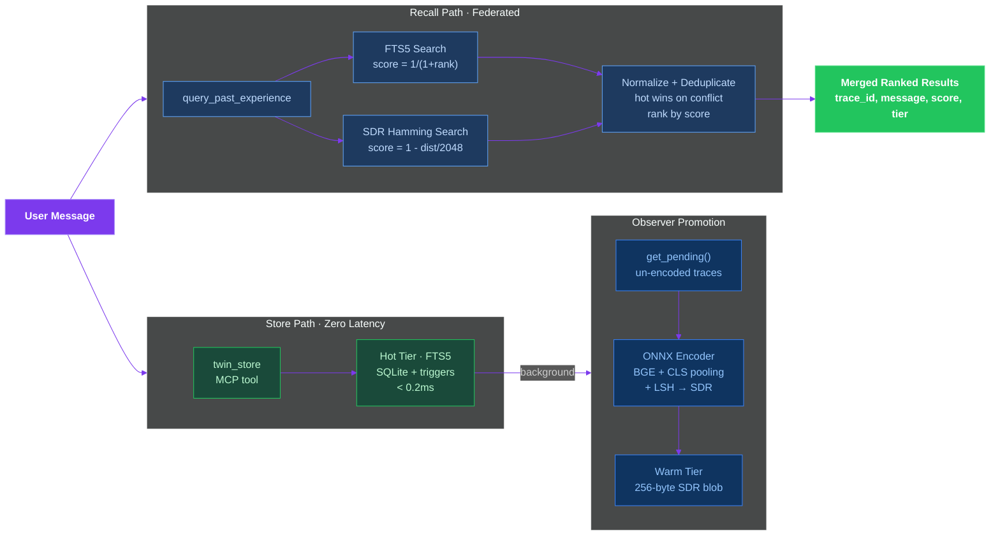
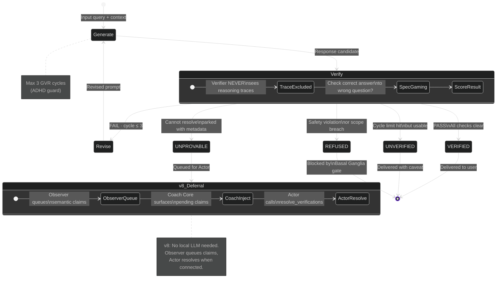
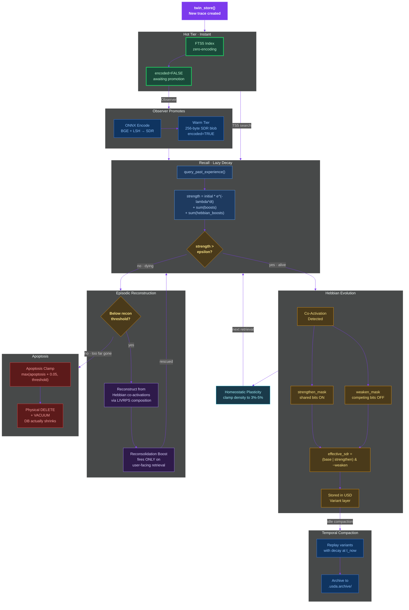
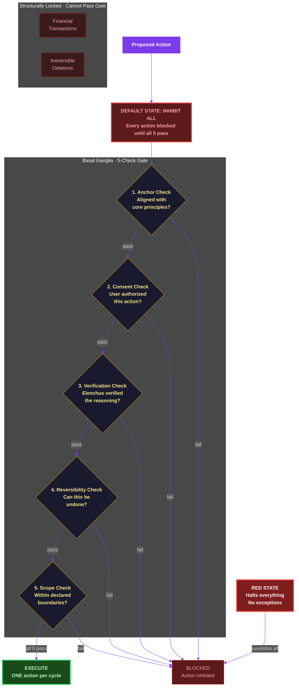
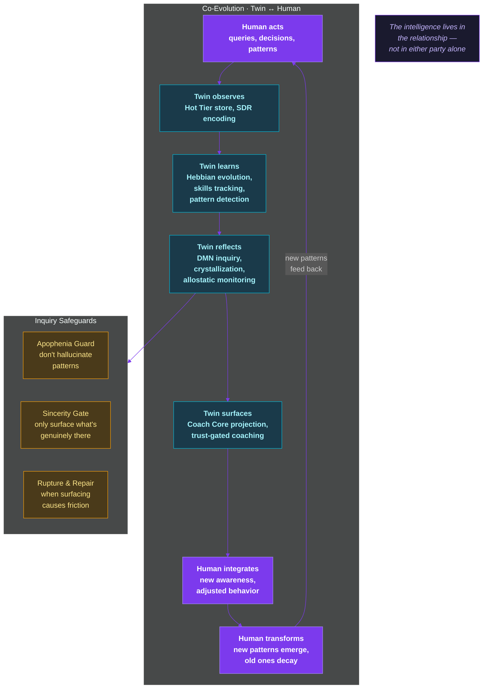
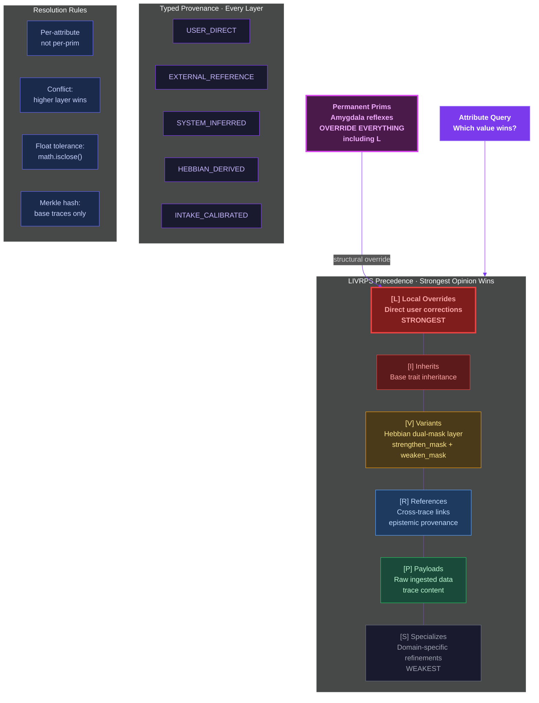

# Cognitive Twin

Your AI forgets you every time. This fixes that.

The Cognitive Twin is a living model of how you think — not a chat log, not a search history, but a persistent layer of *you* that any AI can consult. It remembers your patterns, learns your instincts, verifies what it tells you, and evolves as you do.

## The Problem

Every conversation with an AI starts from scratch. Close the window and everything you built together — your context, your shorthand, the way it was starting to *get* you — vanishes. The next session is a stranger again.

Current "memory" products store what you *said*. The Cognitive Twin stores how you *think*.

It sits between you and any AI, modeling your cognitive patterns: what surprises you, how you make connections, where your expertise runs deep, when you're running on fumes. The AI doesn't just remember your words — it understands your rhythm. And it gets sharper the longer you work together, not because the AI improved, but because your Twin learned more about you.

The intelligence lives in the relationship — not in either party alone.

## How It Works

```
                          COGNITIVE TWIN v8.0
                          ====================

  You ──► Actor (Claude via MCP, 8 tools)
           │
           ▼
  ┌─────────────────────────────────────────────────────────────────┐
  │  ACTOR / OBSERVER ARCHITECTURE                                  │
  │                                                                │
  │  Actor (LLM) reasons ←── Coach Core projection ←── Observer      │
  │       │                                              │          │
  │       ▼                                              │          │
  │  ┌──────────────┐  ┌────────────────────────────────────┐       │
  │  │  HOT TIER    │  │  WARM TIER (L2)                    │       │
  │  │  (L1)        │  │                                    │       │
  │  │  FTS5 search │  │  SDR Hamming search (Rust/PyO3)   │       │
  │  │  Zero encode │  │  ONNX BGE + LSH → 2048-bit SDR   │       │
  │  │  <0.2ms store│  │  <2ms recall                      │       │
  │  └──────┬───────┘  └────────────────────────────────────┘       │
  │         │ Observer promotes (ONNX encode, background)    ▲       │
  │         └────────────────────────────────────────────────┘       │
  │                                                                │
  │  ┌──────────────────────┐     ┌──────────────────────────┐     │
  │  │  FEDERATED RECALL    │     │  ELENCHUS VERIFICATION   │     │
  │  │                      │     │  (GVR Loop, max 3)       │     │
  │  │  FTS5 + SDR Hamming  │     │                          │     │
  │  │  Score normalize     │     │  Trace-excluded verify   │     │
  │  │  Deduplicate + merge │     │  Spec-gaming detection   │     │
  │  └──────────────────────┘     │  v8: Actor-side deferral │     │
  │                               └──────────────────────────┘     │
  │  ┌──────────────────────┐     ┌──────────────────────────┐     │
  │  │  COMPOSITION ENGINE  │     │  MOTOR CORTEX            │     │
  │  │  (Left Hemisphere)   │     │                          │     │
  │  │  Merkle stages       │     │  Basal Ganglia           │     │
  │  │  LIVRPS resolution   │     │  (5-check gate,          │     │
  │  │  Structured          │     │   inhibit-default)       │     │
  │  │    Provenance        │     │  ONE action/cycle        │     │
  │  └──────────────────────┘     └──────────────────────────┘     │
  │  ┌──────────────────────┐     ┌──────────────────────────┐     │
  │  │  HEBBIAN ENGINE      │     │  INQUIRY ENGINE (DMN)    │     │
  │  │                      │     │                          │     │
  │  │  Dual-mask SDR       │     │  Pattern detection       │     │
  │  │    evolution         │     │  Apophenia guard         │     │
  │  │  Episodic context    │     │  Sincerity gate          │     │
  │  │    reconstruction    │     │  Rupture & repair        │     │
  │  │  Homeostatic [3%-5%] │     │  Crystallization         │     │
  │  └──────────────────────┘     └──────────────────────────┘     │
  │  ┌──────────────────────┐     ┌──────────────────────────┐     │
  │  │  USD-LITE CONTAINER  │     │  COGNITIVE PROFILE       │     │
  │  │  17 typed prims      │     │  Adaptive intake         │     │
  │  │  .usda serialization │     │  Trust Ledger [0,1]      │     │
  │  │  Hex SDR (512 chars) │     │  Skills observer         │     │
  │  └──────────────────────┘     └──────────────────────────┘     │
  │  ┌──────────────────────┐                                      │
  │  │  TEMPORAL COMPACTION  │                                      │
  │  │  Replay-then-archive │                                      │
  │  │  Decay commutation   │                                      │
  │  └──────────────────────┘                                      │
  └─────────────────────────────────────────────────────────────────┘
           │
           ▼
  Response (verified, contextual, personally calibrated)
```

The system is event-driven and socket-activated. It idles at 0 watts. No polling, no `sleep()`, no background threads. The daemon wakes on command, does its work, and exits. In v8.0, the Actor (Claude) reasons while the Observer (Twin) stores and projects — no local LLM required.

### Module Hierarchy

The v8.0 architecture as a dependency graph. The Actor (LLM) reasons via MCP tools. The Observer stores, encodes, and projects cognitive state. No LLM dependency in the Observer path.

```mermaid
%%{init: {'theme': 'dark', 'themeVariables': {'primaryColor': '#1a1a2e', 'primaryTextColor': '#e0e0e0', 'primaryBorderColor': '#7c3aed', 'lineColor': '#7c3aed', 'secondaryColor': '#16213e', 'tertiaryColor': '#0f3460'}}}%%
graph TB
    ACTOR["Actor · Claude via MCP\n8 Tools · No local LLM"]:::entry
    OBSERVER["Observer · Background\n0W idle · No LLM deps"]:::entry

    subgraph HOT["Hot Tier · L1"]
        direction TB
        FTS5["FTS5 Full-Text Search\nzero-encoding\n< 0.2ms store"]:::hot
    end

    subgraph WARM["Warm Tier · L2"]
        direction TB
        ONNX["ONNX Encoder\nBGE + LSH → 2048-bit SDR"]:::warm
        RUST["Rust Hot Path · PyO3\nXOR + popcount kNN\n< 2ms recall"]:::warm
        DECAY["Lazy Decay\ncomputed on read"]:::warm
        ONNX --> RUST --> DECAY
    end

    subgraph COACH["Coach · System Prompt"]
        direction TB
        PROJ["Stage → XML Projection\ntrust, traces, claims"]:::coach
    end

    subgraph FED["Federated Recall"]
        direction TB
        MERGE["FTS5 + SDR Hamming\nnormalize + deduplicate"]:::fed
    end

    ACTOR -->|"twin_store"| HOT
    ACTOR -->|"query_past_experience"| FED
    ACTOR -->|"twin_coach"| COACH
    OBSERVER -->|"promote batch"| WARM
    FED --> HOT
    FED --> WARM
    COACH --> HOT

    subgraph BRAINSTEM["Brainstem · Lossless Translation"]
        direction TB
        ADAPT["Adapter Pairs\nnative ↔ USD prims"]:::brainstem
        ROUTE["Z-Score Surprise Router\nSystem 1 / System 2"]:::brainstem
        PROV["Structured Provenance\n5 source types"]:::brainstem
        ADAPT --> ROUTE --> PROV
    end

    subgraph LEFT["Composition Engine · Left Hemisphere"]
        direction TB
        MERKLE["Merkle Stages\nisolated hash trees"]:::left
        LIVRPS["LIVRPS Resolution\nstrongest opinion wins"]:::left
        AUDIT["Audit Trail"]:::left
        MERKLE --> LIVRPS --> AUDIT
    end

    subgraph ELENCHUS["Elenchus Verification"]
        direction TB
        GVR["GVR Loop\nmax 3 cycles"]:::verify
        SPEC["Spec-Gaming Detection"]:::verify
        TRACE_EX["Trace-Excluded Verify\nblinded verifier"]:::verify
        DEFER["v8 Deferral Queue\nObserver queues → Actor resolves"]:::verify
        GVR --> SPEC
        GVR --> TRACE_EX
        GVR --> DEFER
    end

    subgraph MOTOR["Motor Cortex"]
        direction TB
        PREMOTOR["Premotor Planning"]:::motor
        BG["Basal Ganglia Gate\n5-check · inhibit-default"]:::motor
        EXEC["Executor\nONE action/cycle"]:::motor
        PREMOTOR --> BG --> EXEC
    end

    subgraph HEBBIAN["Hebbian Engine"]
        direction TB
        DUAL["Dual-Mask SDR Evolution\nstrengthen + weaken"]:::hebbian
        RECON["Episodic Reconstruction\nvia co-activations"]:::hebbian
        HOMEO["Homeostatic Plasticity\n3%–5% density"]:::hebbian
        TRAIN["Training Data Pipeline\nJSONL · O(1) rotation"]:::hebbian
        DUAL --> RECON
        DUAL --> HOMEO
        DUAL --> TRAIN
    end

    subgraph INQUIRY["Inquiry Engine · DMN"]
        direction TB
        PATTERN["Pattern Detection"]:::inquiry
        APOPH["Apophenia Guard"]:::inquiry
        SINC["Sincerity Gate"]:::inquiry
        PATTERN --> APOPH --> SINC
    end

    subgraph USD["USD-Lite Container"]
        direction TB
        PRIMS["17 Typed Prim Dataclasses"]:::usd
        USDA[".usda Serialization\nround-trip fidelity"]:::usd
        HEX["Hex SDR · 512 chars"]:::usd
        PRIMS --> USDA --> HEX
    end

    subgraph TRUST["Trust & Profile"]
        direction TB
        LEDGER["Trust Ledger\ncontinuous 0.0–1.0"]:::profile
        INTAKE["Adaptive Intake\nneuropsych-informed"]:::profile
        SKILLS["Skills Observer\nincremental"]:::profile
        RECAL["Recalibration\nre-triggerable"]:::profile
        LEDGER --> INTAKE
        INTAKE --> SKILLS
    end

    subgraph COMPACT["Temporal Compaction"]
        direction TB
        REPLAY["Replay-then-Archive\nchronological decay"]:::compact
    end

    %% Connections
    BRAINSTEM <-->|"USD prims"| USD
    BRAINSTEM --> LEFT
    BRAINSTEM --> ELENCHUS
    BRAINSTEM --> MOTOR
    BRAINSTEM --> HEBBIAN
    BRAINSTEM --> INQUIRY
    BRAINSTEM --> TRUST
    WARM --> COMPACT

    %% Styles
    classDef entry fill:#7c3aed,stroke:#a78bfa,color:#fff,font-weight:bold
    classDef hot fill:#1a4a3a,stroke:#22c55e,color:#bbf7d0,stroke-width:3px
    classDef warm fill:#1a4a3a,stroke:#22c55e,color:#bbf7d0
    classDef coach fill:#0f3460,stroke:#3b82f6,color:#93c5fd
    classDef fed fill:#1e3a5f,stroke:#60a5fa,color:#bfdbfe
    classDef brainstem fill:#0f3460,stroke:#3b82f6,color:#93c5fd
    classDef left fill:#2e1a4a,stroke:#a78bfa,color:#ddd6fe
    classDef verify fill:#1a3a4a,stroke:#06b6d4,color:#a5f3fc
    classDef motor fill:#5c1a1a,stroke:#ef4444,color:#fca5a5
    classDef hebbian fill:#4a3a1a,stroke:#f59e0b,color:#fde68a
    classDef inquiry fill:#1e3a5f,stroke:#60a5fa,color:#bfdbfe
    classDef usd fill:#1a2a1a,stroke:#22c55e,color:#bbf7d0
    classDef profile fill:#3a1a4a,stroke:#d946ef,color:#f0abfc
    classDef compact fill:#4a3a1a,stroke:#f59e0b,color:#fde68a
```



### Store & Recall Pipeline

How data flows through the v8.0 dual-tier system:



### Elenchus Verification States

The Generate-Verify-Revise loop, its four terminal states, and the v8 Actor-side deferral model:



### Trace Lifecycle

The full journey of a memory trace — from hot storage through encoding, promotion, recall, Hebbian evolution, compaction, and eventual apoptosis:



### Motor Cortex Decision Gate

Inhibition-default: every action must pass ALL five checks or it's blocked.



### Co-Evolution Spiral

How the Twin and the human transform each other through interaction:



## Key Design Decisions

**Actor/Observer split (v8.0).** The Actor (Claude) reasons. The Observer (Twin) stores and projects. The MCP server requires no `ANTHROPIC_API_KEY` — it is a pure data layer. The Observer runs background SDR encoding and promotion without any LLM dependency. The Coach projects cognitive state as a system prompt for the Actor.

**Hot/Warm tiered memory (v8.0).** Traces are stored instantly to the Hot Tier via FTS5 (zero-encoding, <0.2ms p99). The Observer asynchronously promotes them to the Warm Tier via ONNX SDR encoding. Federated recall (`query_past_experience`) searches both tiers simultaneously, normalizes scores, deduplicates, and returns merged ranked results.

**1-bit SDR bitvectors, not float embeddings.** Memory search uses 2048-bit Sparse Distributed Representations. Hamming distance via XOR + popcount. No cosine similarity, no float32 storage. The Rust hot path processes these at <2ms for recall.

**USD-Lite container format.** Every subsystem writes to a shared USD stage with 17 typed prim dataclasses. `.usda` text serialization with proven round-trip fidelity. LIVRPS composition with permanent-prim handling. Float tolerance via `math.isclose()`. SDR arrays packed as 512-char hex strings (not 6KB text arrays).

### LIVRPS Composition Precedence

Pixar's USD composition ordering adapted for brain state. Strongest opinion wins per attribute. Permanent prims (Amygdala reflexes) override everything.



**Brainstem lossless translation.** Each subsystem gets one adapter pair (native to/from USD prims). Round-trip fidelity proven by Hypothesis property-based testing. Z-score surprise metric drives dual-process routing: System 1 (fast hamming search) escalates to System 2 (deliberative LIVRPS) when surprise exceeds the user's personal threshold.

**Dual-mask Hebbian learning (not XOR).** Co-activated traces strengthen shared bits; competing traces weaken them. Separate `strengthen_mask` and `weaken_mask` stored in the [V] Variant USD layer. Formula: `effective_sdr = (base | strengthen) & ~weaken`. Conflict resolution: weaken wins. Base SDR in SQLite stays pristine. Merkle hash computed over base traces only. Homeostatic plasticity clamps activation density to [3%, 5%].

**Episodic context reconstruction.** Degraded traces below the reconstruction threshold are rebuilt from Hebbian-linked co-activations via LIVRPS composition. The apoptosis clamp (`max(apoptosis + 0.05, threshold)`) prevents the race condition where traces die before qualifying for reconstruction. Reconsolidation boost fires only on user-facing retrieval — traces cannot bootstrap their own survival.

**Cognitive profile intake.** An adaptive neuropsych-informed questionnaire calibrates personal thresholds. Continuous [0.0, 1.0] scoring with deterministic linear interpolation. Semantic ceiling detection (not answer length). The Twin works from the first interaction with universal defaults; the intake makes it work *better*.

**Trust Ledger (v8.0).** A continuous [0.0, 1.0] trust score gates Observer behavior. Tiers: New (0.0–0.3, passive store only), Familiar (0.3–0.7, context/pattern surfacing), Trusted (0.7–1.0, proactive coaching/pushback). The Basal Ganglia evaluates the float directly. `trigger_cognitive_recalibration` resets trust + profile for major life changes.

**Lazy decay, not polling.** Trace strength is computed on retrieval: `strength = initial * e^(-lambda * dt) + sum(boosts) + sum(hebbian_boosts)`. No background jobs. Traces below epsilon are physically deleted (apoptosis) with `VACUUM` — the database actually shrinks.

**Temporal compaction (v8.0).** Deep-idle process replays variant stacks chronologically with exponential decay, writes resolved baselines, and archives originals. Critical invariant: `flatten(decay(variants)) == decay(flatten(variants))` — verified by tests.

**Elenchus verification pipeline.** Every LLM response runs through Generate-Verify-Revise. Max 3 cycles (ADHD guard). The verifier never sees reasoning traces (structural constraint). Spec-gaming detection catches correct answers to wrong questions. Unresolvable outputs are parked as UNPROVABLE with full metadata. In v8.0, the Observer queues semantic claims and the Actor resolves them via `resolve_verifications` — no local LLM required.

**Inhibition-default motor cortex.** The Basal Ganglia gate defaults to INHIBIT ALL. Every action requires all five checks (anchor, consent, verification, reversibility, scope). Financial transactions and irreversible deletions are structurally locked. RED state halts everything.

**Structured provenance.** Every composition layer carries a typed Provenance dataclass (source_type, origin_timestamp, event_hash, session_id). Five source types: USER_DIRECT, EXTERNAL_REFERENCE, SYSTEM_INFERRED, HEBBIAN_DERIVED, INTAKE_CALIBRATED. Legacy layers receive SYSTEM_INFERRED during migration.

**Elenchus training data pipeline.** Every verification event appends a JSONL row with the full cognitive profile feature vector (not just a hash). O(1) amortized log rotation at 10,000 rows. No reasoning traces (Rule 11). Ready for LoRA fine-tuning of a personalized verification model.

## Quick Start

```bash
git clone <repo-url> && cd cognitive-twin

# Python environment
python -m venv .venv && source .venv/bin/activate   # or .venv\Scripts\activate on Windows
pip install -e .
pip install onnxruntime transformers

# Build Rust hot path (optional — system falls back to Python encoding)
pip install maturin
maturin develop -r

# v8: No ANTHROPIC_API_KEY needed for the MCP server.
# The Actor (Claude) provides reasoning. The Twin stores and projects.
```

## Project Structure

```
python/cognitive_twin/
├── elenchus/          Verification engine — GVR loop, spec-gaming, trace exclusion
├── elenchus_v8/       v8 deferred verification — pending queue, Actor-side resolution
├── brainstem/         Lossless translation — adapters, routing, generation pipeline,
│                        amygdala, consolidation, provenance, escalation
├── cli/               Click CLI — human + JSON output
│   └── commands/      Individual command implementations
├── coach/             v8 Coach Core — stage → system prompt projection (Anthropic XML)
├── compaction/        v8 temporal compaction — replay-then-archive, decay commutation
├── composition/       Left hemisphere — Merkle stages, LIVRPS resolution, audit trail
├── daemon/            Socket-activated daemon — router, config, lifecycle
├── encoder/           Triple-path encoding — semantic (BGE+LSH), lexical (Rust),
│                        ONNX (v8, BGE+CLS pooling)
├── federated_recall.py  v8 federated query — FTS5 + SDR Hamming merged search
├── hebbian/           Neuroplasticity — dual-mask SDR evolution, reconstruction,
│                        training data pipeline
├── hot_store/         v8 Hot Tier (L1) — SQLite + FTS5, zero-encoding, promotion pipeline
├── inquiry/           Default Mode Network — pattern surfacing, safeguards, co-evolution
├── intake/            Cognitive profile — adaptive questionnaire, multiplier derivation
├── modulation/        Brainstem — allostatic load, gain, barrier, pattern detection
├── motor/             Motor cortex — premotor planning, Basal Ganglia gate, executor
├── observer/          v8 Observer — background Hot→Warm promotion, no LLM deps
├── provider/          LLM abstraction — Protocol-based, Claude and OpenAI adapters
├── session/           Session lifecycle — SQLite-backed, history, expiration
├── skills/            Competence tracking — incremental observer, 4 query patterns
├── trust/             v8 Trust Ledger — continuous [0,1] score, recalibration
├── usd_lite/          USD container — 17 prim dataclasses, .usda serialization, LIVRPS
└── migrate_v7.py      v6 → v7 migration (bootstraps /Skills from legacy traces)

crates/hippocampus/    Rust hot path — SDR encode, XOR search, lazy decay, apoptosis
config/                Barrier schema, verification depth, default profile
data/                  Runtime data — stages, reflexes, audit, training data
models/                ONNX model files (bge-small-en-v1.5.onnx, tokenizer)
scripts/               Daemon start/stop, model download
tests/                 27 test modules across all subsystems
```

## Testing

**791 tests**, all passing.

```bash
python -m pytest tests/ -v --ignore=tests/test_encoder --ignore=tests/test_daemon
                                                         # Full Python suite (791)
cargo test -p hippocampus                                # Rust tests (41)
python -m pytest tests/test_hot_store/ -v                # Hot Tier CRUD + FTS5
python -m pytest tests/test_onnx/ -v                     # ONNX encoding fidelity
python -m pytest tests/test_federated_recall/ -v         # Federated recall
python -m pytest tests/test_observer/ -v                 # Observer lifecycle
python -m pytest tests/test_coach/ -v                    # Coach Core projection
python -m pytest tests/test_trust/ -v                    # Trust Ledger
python -m pytest tests/test_elenchus_v8/ -v              # Elenchus v8 deferral
python -m pytest tests/test_compaction/ -v               # Temporal compaction
python -m pytest tests/test_latency/ -v                  # SLA enforcement
```

Coverage spans: Hot Tier CRUD + FTS5 search, ONNX encoding fidelity (Hamming correlation >= 0.95), federated recall merge + deduplication, Observer promotion lifecycle, Coach Core XML projection, Trust Ledger continuous updates + tier gating, Elenchus v8 pending queue + claim resolution, temporal compaction with decay commutation, latency SLAs (store <2ms, FTS5 <2ms, Coach <10ms), plus all v7 coverage: USD serialization round-trip, hex SDR encoding, LIVRPS composition, adapter fidelity (Hypothesis), Z-score surprise routing, Merkle isolation, dual-mask Hebbian correctness, homeostatic stability, episodic reconstruction, apoptosis clamp, reconsolidation boost gating, training data JSONL, cognitive profile scoring, GVR protocol, spec-gaming detection, Basal Ganglia gating, structured provenance, and compliance with all 33 architectural rules.

## Research Alignment

| Research Concept | Implementation | Status |
|---|---|---|
| SSGM temporal decay | Lazy decay with Hebbian boost integration | Extended |
| SSGM pre-consolidation validation | Elenchus trace exclusion (blinded) | Already ahead |
| SSGM provenance | Structured 5-type Provenance dataclass | **New in v7** |
| SSGM fragment reconstruction | Episodic reconstruction via Hebbian + LIVRPS | **New in v7** |
| Titans test-time memorization | Hebbian dual-mask SDR evolution | **New in v7** |
| Titans forgetting gate | Apoptosis (more aggressive, with clamp) | Already ahead |
| Mnemis entropy gating | Z-score surprise metric + dual-process routing | **New in v7** |
| HiMem reconsolidation | Brain-wide LIVRPS + reconsolidation boost | Extended |
| LoCoMo-Plus Level-2 memory | Skills observer + competence tracking | **New in v7** |
| Analog I sovereign refusal | Basal Ganglia inhibition-default gate | Already ahead |
| (No equivalent in literature) | Cognitive Profile intake system | **Original** |
| (No equivalent in literature) | Hot/Warm tiered memory with federated recall | **New in v8** |
| (No equivalent in literature) | Actor/Observer disaggregation (zero-LLM Observer) | **New in v8** |
| (No equivalent in literature) | Coach Core system prompt projection from cognitive state | **New in v8** |
| (No equivalent in literature) | Replay-then-archive temporal compaction | **New in v8** |

## MCP Quick Reference

The Cognitive Twin exposes 8 tools via [Model Context Protocol](https://modelcontextprotocol.io). Works with Claude Desktop, Claude Code, and any MCP-compatible client. No `ANTHROPIC_API_KEY` required — the Actor (Claude) provides reasoning, the Twin stores and projects.

### `twin_store` — Store a memory trace (Hot Tier)

```
twin_store(message, domain?, tags?)
```

| Param | Type | Required | Example |
|-------|------|----------|---------|
| `message` | string | yes | `"Resolved Python 3.12 path issue by installing mcp into PATH Python"` |
| `domain` | string | no | `"technical"`, `"debugging"`, `"architecture"`, `"decision"` |
| `tags` | string[] | no | `["mcp", "python-path", "resolved"]` |

Zero-encoding hot path. Writes to FTS5-indexed Hot Tier in <0.2ms. Returns `{status: "stored", trace_id, tier: "hot", encoded: false}`. Observer promotes to Warm Tier asynchronously.

### `query_past_experience` — Federated recall (Hot + Warm)

```
query_past_experience(query, limit?)
```

| Param | Type | Required | Example |
|-------|------|----------|---------|
| `query` | string | yes | `"Python import issues"` |
| `limit` | integer | no | `10` (default) |

Searches both Hot Tier (FTS5 plaintext) and Warm Tier (SDR Hamming distance) simultaneously. Returns merged, deduplicated, ranked results with tier labels and normalized scores.

### `twin_recall` — Warm-tier semantic search

```
twin_recall(query, depth?)
```

| Param | Type | Required | Example |
|-------|------|----------|---------|
| `query` | string | yes | `"Python import issues"` |
| `depth` | `"normal"` \| `"deep"` | no | `"normal"` (top 5) or `"deep"` (top 15) |

Warm-tier SDR Hamming distance search. Returns matching traces ranked by distance with strength scores and confidence. For federated search across both tiers, use `query_past_experience`.

### `twin_coach` — Coaching context (system prompt projection)

```
twin_coach(session_id?)
```

| Param | Type | Required | Example |
|-------|------|----------|---------|
| `session_id` | string | no | `"abc123"` |

Returns an Anthropic XML system prompt block built from current Twin state: trust level, recent traces, session info, pending Elenchus claims, and pattern count. Deterministic for the same state.

### `twin_patterns` — Detect clusters and escalation

```
twin_patterns()
```

No arguments. Runs all detection algorithms:
- **Recurring themes** — semantic clustering via SDR hamming distance
- **Temporal patterns** — trace co-occurrence within 24h windows
- **Allostatic load** — escalation tracking across sessions

### `twin_session_status` — Active session info

```
twin_session_status()
```

No arguments. Returns active sessions with exchange count, allostatic load, domain, and timing.

### `resolve_verifications` — Actor-side Elenchus verification

```
resolve_verifications(verdicts)
```

| Param | Type | Required | Example |
|-------|------|----------|---------|
| `verdicts` | array | yes | `[{"claim_id": "abc", "verdict": true}]` |

The Actor evaluates pending Elenchus claims and submits boolean verdicts. Claims move to verified or rejected. Returns remaining pending count.

### `trigger_cognitive_recalibration` — Reset intake + trust

```
trigger_cognitive_recalibration()
```

No arguments. Resets the cognitive profile and trust score to zero. Use when the user indicates a major life or role change. Idempotent and re-triggerable.

### Setup

Add to `claude_desktop_config.json`:

```json
{
  "mcpServers": {
    "cognitive-twin": {
      "command": "cognitive-twin"
    }
  }
}
```

### How It Works

- **Store**: Zero-encoding Hot Tier (FTS5, <0.2ms) + background SDR promotion to Warm Tier (ONNX BGE)
- **Recall**: Federated search across both tiers with score normalization and deduplication
- **Encoder**: ONNX Runtime BGE + CLS pooling + LSH -> 2048-bit SDR (Hamming correlation >= 0.95 with reference)
- **Container**: USD-Lite with 17 typed prim dataclasses + `.usda` serialization
- **Search**: XOR + popcount (Hamming distance) — sub-2ms warm recall
- **Routing**: Z-score surprise metric -> System 1 / System 2 dual-process
- **Learning**: Dual-mask Hebbian SDR evolution with homeostatic plasticity
- **Decay**: Lazy (computed on read, not background jobs)
- **Verification**: Elenchus GVR loop (trace-excluded, max 3 cycles) + v8 Actor-side deferral
- **Trust**: Continuous [0.0, 1.0] ledger gating Observer behavior into 3 tiers
- **Compaction**: Replay-then-archive with decay commutation invariant
- **Hot path**: Rust via PyO3 (`hippocampus` crate)

## The 33 Rules

The architecture is constrained by 33 inviolable rules covering biological fidelity (0W idle, 1-bit SDRs, lazy decay), verification integrity (trace exclusion, max 3 GVR cycles, verified-only consolidation), inquiry safeguards (apophenia guard, sincerity gate, rupture & repair), motor safety (inhibition default, one action at a time, RED kills everything), and Hebbian constraints (Merkle isolation, dual masks not XOR, homeostatic plasticity). These aren't guidelines — they're structural constraints enforced by 791 tests. See `CLAUDE.md` for the full specification.

## Philosophy

The Cognitive Twin is a self-evolving dialogue between a human and their externalized cognition, where both participants transform through the interaction, and the intelligence lives in the relationship — not in either party alone.

You own your mind. AI models just rent access to it.

## License

Proprietary. Copyright Joseph O. Ibrahim, 2026.
