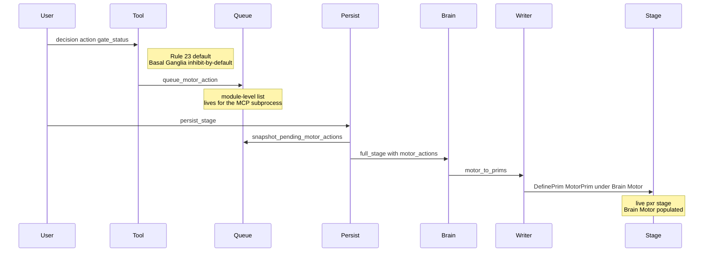
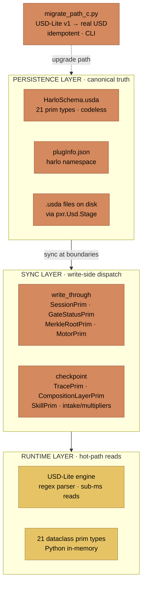
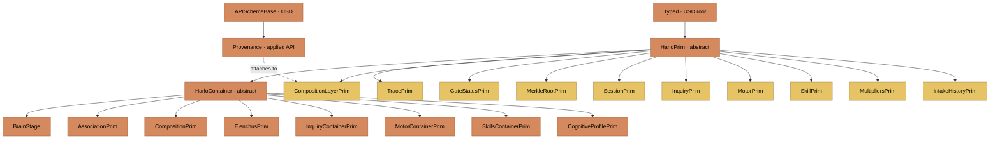
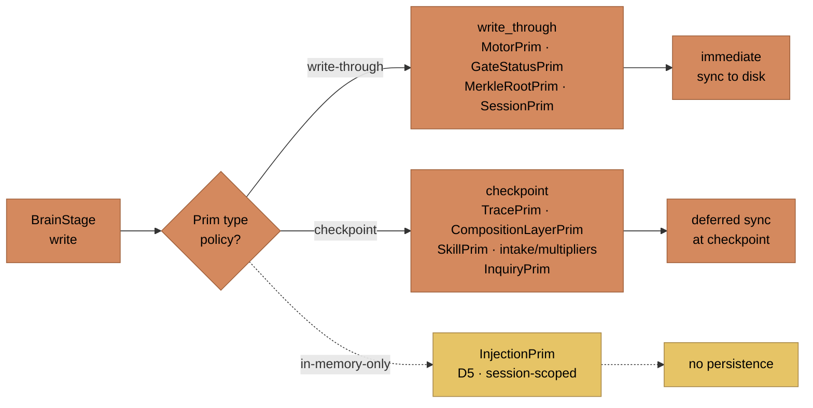
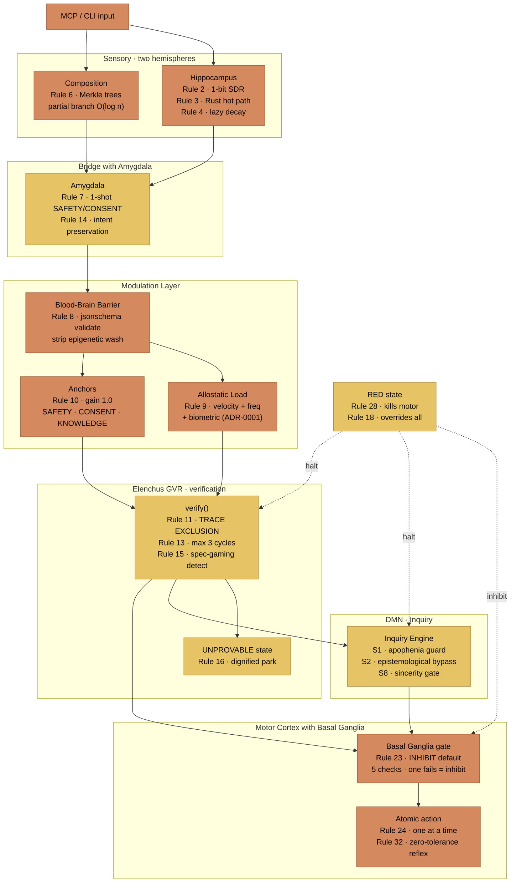
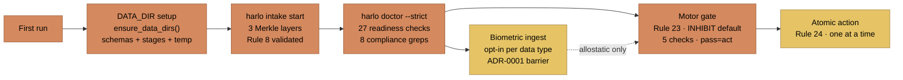
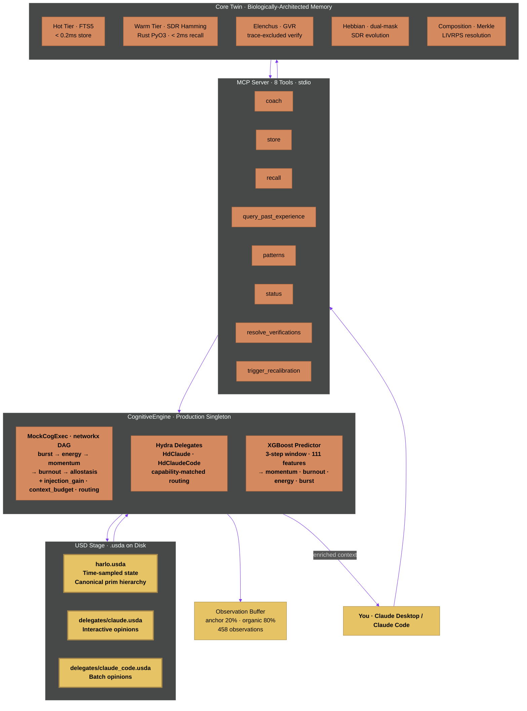
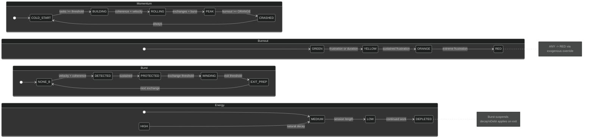
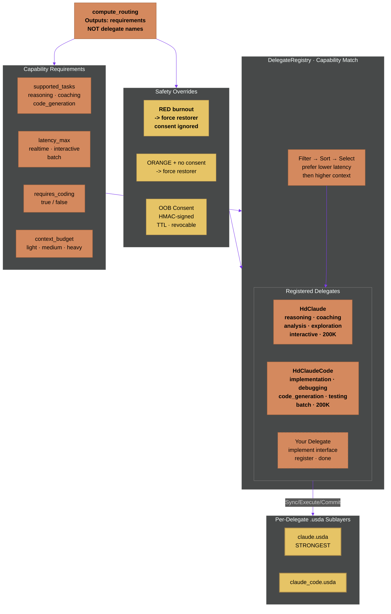
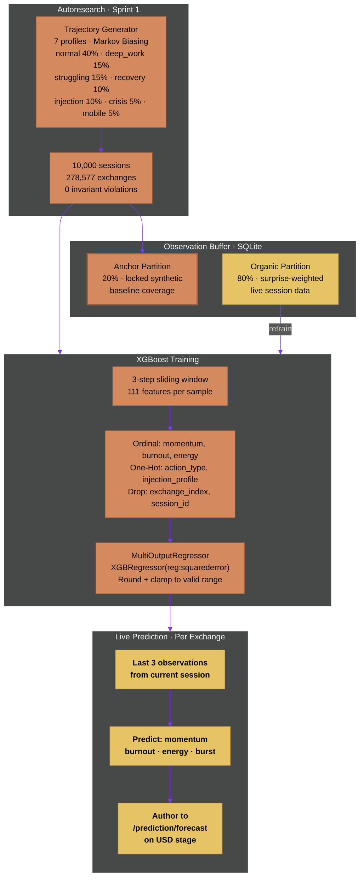

<p align="center">
  
</p>

<p align="center">
  <strong>Patent Pending</strong> | <a href="LICENSE">Apache 2.0</a> | <a href="PATENTS.md">Patent Details</a>
</p>

---

Your AI coach. Watches your patterns, predicts your crashes, backs off during
flow, and tells you when to stop before you burn out. Built on USD composition
semantics for persistent, local-first cognitive state management.

Your memory, your device. Harlo stores all state locally as composable USD
layers — no cloud dependency, no data mining, no rented access to your own mind.

---

## Status

```
PRODUCTION LIVE — Harlo v6.1-MOTOR
1,365 passing · 11 skipped · Real OpenUSD canonical persistence · USD-Lite runtime tier
8/8 phase gates passed · 19 D-block decisions clean (D1-D19)
Substrate-unified with sister project Moneta · P1 CIP defensible
458 organic observations collected · 5 sprints shipped · Path C closed (Step 3)
Phase 5A landed: macOS bundle · intake calibration · biometric barrier · Motor Cortex with Basal Ganglia gating
v0.1.2: USD-proof trial — §F1 native composition · §F2 structural lossless · anchor immunity · P5 customData · P1 decision-tier — CONFIRMED on live pxr stage (verifier-first, 4 cycles)
```

| Sprint | Tests | What Shipped |
|--------|-------|-------------|
| **S1** State Machine | 84 | Pydantic schemas, MockCogExec DAG (networkx), 7 pure computation functions, 26-invariant validator, 10K synthetic trajectories via Profile-Driven Markov Biasing, XGBoost predictor (100% per-field accuracy), Bridge integration |
| **S2** OpenExec | -- | USD 26.03 built from source with `PXR_BUILD_EXEC=ON`. C++ Exec libraries compile. **Circuit-breaker triggered:** zero Python bindings in v26.03 source. MockCogExec continues to serve. |
| **S3** Hydra Delegates | 85 | HdCognitiveDelegate ABC, DelegateRegistry (capability matching), HdClaude + HdClaudeCode, compute_routing (requirements not names), OOB consent tokens (HMAC-signed, TTL), sublayer-per-delegate concurrency, CognitiveEngine singleton, 20-exchange e2e |
| **S4** Real USD | 59 | CognitiveStage wrapping `pxr.Usd.Stage`, stage_factory toggle, `.usda` files on disk with time-sampled CognitiveObservation, delegate sublayer `.usda` files, backend parity verified (mock = real USD) |
| **S5** Production | 22 | Graceful degradation (independent failure isolation), health check endpoint, kill switches (`ENGINE_ENABLED`, `USE_REAL_USD`, `OBSERVATION_LOGGING`, `PREDICTION_ENABLED`), first session verified, production docs |
| **Path C** Step 3 v3.4.0 | +39 | Real OpenUSD as canonical persistence (codeless schema, 21 prim types under `harlo` plugin separate from Moneta); USD-Lite engine preserved as fast in-memory runtime tier (Fabric pattern); sync layer per D4 policy table; migration script for USD-Lite v1 → real USD; substrate-unified with sister project Moneta. P1 CIP framing now defensible. |
| **Phase 5A** macOS + Operator | +51 | macOS app bundle (Harlo.app + launchd socket activation), intake calibration CLI emitting three INTAKE_CALIBRATED Merkle layers, biometric barrier per ADR-0001 (opt-in HealthKit signals, freshness window, never enter trace pipeline), Motor Cortex with Basal Ganglia inhibition-default gating, `harlo doctor --strict` operator readiness, signing-readiness pre-flight (27 checks) |
| **USD Trial** v0.1.2 | +verifier | SOLO trial-harness loop (`docs/trial-harness.md` + `docs/usd-proof-trial.md`); 4 engine cycles verifier-first against `wave1_harness.py`; native USD-composition theses CONFIRMED on the live `pxr`-backed stage: §F1 `LOCAL > VARIANT > SPECIALIZE` resolution, §F2 `reconstruct_clean` bit-identical, anchor structural immunity (adversarial probe), P5 customData state tracking; new MCP tools — `compose_demo`, `lossless_demo`, `anchor_demo`, `p5_state_demo`, `persist_stage`, `decision`. P1 closed via Path C Actor-driven motor surface. |

---

## USD Substrate Trial — Live-Stage Theses Confirmed (v0.1.2)

Four engine cycles run against a verifier-first SOLO trial harness proved
the foundational USD-as-cognitive-substrate theses **on the live `pxr`-
backed `real_usd` stage** — not via Python proxy, not by parametric
guarantee. Every cycle observed RED before the change, GREEN after, and
was independently re-verified in a cold-pxr process. Trial state lives
in `docs/usd-proof-trial.md` (SPEC + CHAMPION v6 + LOG).

- **§F1 — USD-native-priority** (Cycle 2). pxr resolves
  `LOCAL > VARIANT > SPECIALIZE` on `/Brain/CompositionDemo`.
  `GetPropertyStack` reports the strength order itself. Native composition
  arcs map to cognitive priority without fighting USD semantics.
- **§F2 — structural lossless** (Cycle 3). `reconstruct_clean()` as
  flatten-to-base recovers the clean baseline bit-identically from a
  composed (clean + delta) stage. Same SHA256 from cold-pxr re-read;
  reconstruction is exact, not float-tolerant.
- **§F2 anchor structural immunity** (Cycle 4). CONSTITUTIONAL / SAFETY /
  CONSENT / KNOWLEDGE anchors invariant across 4 delta profiles. The
  adversarial profile explicitly authors
  `/Brain/Anchors/CONSTITUTIONAL.value = "MALICIOUS_OVERRIDE"`; pxr
  rejects it by composition mechanics — anchor sublayer at
  `subLayerPaths[0]` wins. Structural, not parametric.
- **P5 — customData state tracking** (Cycle 5). Unchanged / Edited / New
  derived per-prim from prim-stack analysis, written to a derived tags
  sublayer, read back through composition. Three prims, three states —
  tagged / computed / expected all agree.
- **P1 decision-tier closure** (Cycle 6). New `decision` MCP tool — the
  Actor-driven motor surface — queues MotorPrims that
  `persist_current_brain` drains. Live stage now authors session +
  entity + decision tiers.

Reproduce: `.venv312/bin/python wave1_harness.py`. The 7-row scoreboard
asserts the live USD flip, populated hierarchy (P1), native composition
(P3 / §F1), structural lossless (P4 / §F2), anchor immunity (§F2 follow-
up), and customData state tracking (P5).

### Path C motor surface (Cycle 6) — Actor → live MotorPrim


```mermaid
sequenceDiagram
    participant User
    participant Tool
    participant Queue
    participant Persist
    participant Brain
    participant Writer
    participant Stage
    User->>Tool: decision action gate_status
    Note right of Tool: Rule 23 default<br/>Basal Ganglia inhibit-by-default
    Tool->>Queue: queue_motor_action
    Note over Queue: module-level list<br/>lives for the MCP subprocess
    User->>Persist: persist_stage
    Persist->>Queue: snapshot_pending_motor_actions
    Persist->>Brain: full_stage with motor_actions
    Brain->>Writer: motor_to_prims
    Writer->>Stage: DefinePrim MotorPrim under Brain Motor
    Note over Stage: live pxr stage<br/>Brain Motor populated
```

Diagram legend:
- **User** = the actor (Claude in production; the trial harness in tests)
- **Tool** = `decision` MCP tool (Actor-driven motor surface)
- **Queue** = `_PENDING_MOTOR_ACTIONS` module-level list in `persistence/__init__.py`
- **Persist** = `persist_current_brain` (called by `persist_stage` MCP tool)
- **Brain** = `brainstem.stage_builder.full_stage(motor_actions=…)`
- **Writer** = `python/harlo/usd_lite/persistence/writer.py:_write_motor` — `stage.DefinePrim("/Brain/Motor/action_i", "MotorPrim")`
- **Stage** = `<DATA_DIR>/stages/runtime.usda` (the live `pxr.Usd.Stage`)

The inert motor system (`premotor`, `basal_ganglia`, `executor`) remains
disconnected — Path C creates the **smallest honest motor surface**.
Consent escalation, basal-ganglia gating, and executor wiring are parked
for future cycles.

---

## Architecture · Path C (Fabric Pattern)

v3.4.0-path-c introduced **codeless OpenUSD schemas** as canonical
persistence while preserving the existing USD-Lite engine as a fast
in-memory runtime tier. Path C — the **Fabric pattern** — separates
the two tiers so each can win at what it's good at: real OpenUSD owns
durability and patent claims; USD-Lite owns hot-path latency.

### Fabric pattern


```mermaid
flowchart TB
    subgraph PERSISTENCE["PERSISTENCE LAYER · canonical truth"]
        SCHEMA["HarloSchema.usda<br/>21 prim types · codeless"]:::substrate
        PLUG["plugInfo.json<br/>harlo namespace"]:::substrate
        DISK[".usda files on disk<br/>via pxr.Usd.Stage"]:::substrate
    end

    subgraph SYNCLAYER["SYNC LAYER · write-side dispatch"]
        WT["write_through<br/>SessionPrim · GateStatusPrim<br/>MerkleRootPrim · MotorPrim"]:::substrate
        CP["checkpoint<br/>TracePrim · CompositionLayerPrim<br/>SkillPrim · intake/multipliers"]:::substrate
    end

    subgraph RUNTIME["RUNTIME LAYER · hot-path reads"]
        ENGINE["USD-Lite engine<br/>regex parser · sub-ms reads"]:::runtime
        DC["21 dataclass prim types<br/>Python in-memory"]:::runtime
    end

    MIG["migrate_path_c.py<br/>USD-Lite v1 → real USD<br/>idempotent · CLI"]:::substrate

    PERSISTENCE -->|"sync at boundaries"| SYNCLAYER
    SYNCLAYER --> RUNTIME
    MIG -.->|"upgrade path"| PERSISTENCE

    classDef substrate fill:#d4895e,stroke:#a0623d,color:#000000
    classDef runtime fill:#e6c466,stroke:#a8884a,color:#000000
```

The persistence layer is the canonical truth. The runtime layer is the
fast tier that tests and live sessions exercise. The sync layer routes
mutations between them based on a per-prim policy table. Reads always
hit the runtime tier; persistence is touched only at sync boundaries
(Constitution Law 4).

The `[substrate]` extra activates the persistence layer:

```bash
pip install -e .[substrate]   # Pulls usd-core 26.5; activates persistence/
```

Core Harlo runs without `[substrate]` — `pxr` stays optional per
Constitution Law 3.

### Schema · IsA hierarchy

The codeless schema in `schema/HarloSchema.usda` declares 21 prim types
in a 3-tier IsA hierarchy parallel to containment (D2):


```mermaid
flowchart TB
    Typed["Typed · USD root"]:::substrate

    HP["HarloPrim · abstract"]:::substrate
    HC["HarloContainer · abstract"]:::substrate

    Typed --> HP
    HP --> HC

    BS["BrainStage"]:::substrate
    AP["AssociationPrim"]:::substrate
    CP["CompositionPrim"]:::substrate
    EP["ElenchusPrim"]:::substrate
    ICP["InquiryContainerPrim"]:::substrate
    MCP["MotorContainerPrim"]:::substrate
    SCP["SkillsContainerPrim"]:::substrate
    CPP["CognitiveProfilePrim"]:::substrate

    HC --> BS
    HC --> AP
    HC --> CP
    HC --> EP
    HC --> ICP
    HC --> MCP
    HC --> SCP
    HC --> CPP

    TP["TracePrim"]:::runtime
    CLP["CompositionLayerPrim"]:::runtime
    GSP["GateStatusPrim"]:::runtime
    MRP["MerkleRootPrim"]:::runtime
    SP["SessionPrim"]:::runtime
    IP["InquiryPrim"]:::runtime
    MP["MotorPrim"]:::runtime
    SkP["SkillPrim"]:::runtime
    MuP["MultipliersPrim"]:::runtime
    IHP["IntakeHistoryPrim"]:::runtime

    HP --> TP
    HP --> CLP
    HP --> GSP
    HP --> MRP
    HP --> SP
    HP --> IP
    HP --> MP
    HP --> SkP
    HP --> MuP
    HP --> IHP

    APIB["APISchemaBase · USD"]:::substrate
    PROV["Provenance · applied API"]:::substrate
    APIB --> PROV
    PROV -.->|"attaches to"| CLP

    classDef substrate fill:#d4895e,stroke:#a0623d,color:#000000
    classDef runtime fill:#e6c466,stroke:#a8884a,color:#000000
```

- **Two abstract bases:** `HarloPrim` (root of every Harlo type) and
  `HarloContainer` (parent of structural composites).
- **Eight concrete container types:** `BrainStage` plus seven subsystem
  containers (Association, Composition, Elenchus, Inquiry, Motor,
  Skills, CognitiveProfile).
- **Ten concrete leaf types** holding the actual cognitive-state
  attributes.
- **One singleApply API schema** (`Provenance`, per D10) that attaches
  origin metadata to host prims without cluttering the IsA tree.

Five enum types use lower-case `allowedTokens` per Constitution Cmd 11:
`SourceType`, `VerificationState`, `RetrievalPath`, `MotorGateStatus`,
`ArcType`. Cross-plugin: zero collisions with sister project Moneta's
`MonetaMemory` typeName (D3 verified).

### Sync layer · per-prim policy

The sync layer at `python/harlo/sync/` routes writes per the D4 policy
table:


```mermaid
flowchart LR
    START["BrainStage<br/>write"]:::substrate
    DECISION{"Prim type<br/>policy?"}:::substrate

    WT["write_through<br/>MotorPrim · GateStatusPrim<br/>MerkleRootPrim · SessionPrim"]:::substrate
    CP["checkpoint<br/>TracePrim · CompositionLayerPrim<br/>SkillPrim · intake/multipliers<br/>InquiryPrim"]:::substrate
    INMEM["InjectionPrim<br/>D5 · session-scoped"]:::runtime

    OUT_WT["immediate<br/>sync to disk"]:::substrate
    OUT_CP["deferred sync<br/>at checkpoint"]:::substrate
    OUT_INMEM["no persistence"]:::runtime

    START --> DECISION
    DECISION -->|"write-through"| WT
    DECISION -->|"checkpoint"| CP
    DECISION -.->|"in-memory-only"| INMEM
    WT --> OUT_WT
    CP --> OUT_CP
    INMEM -.-> OUT_INMEM

    classDef substrate fill:#d4895e,stroke:#a0623d,color:#000000
    classDef runtime fill:#e6c466,stroke:#a8884a,color:#000000
```

- **write_through** — synchronous persistence on every mutation. Used
  for consistency-critical prims (`SessionPrim`, `GateStatusPrim`,
  `MerkleRootPrim`) and the safety-critical `MotorPrim` (D4 ruling).
- **checkpoint** — deferred persistence; callers mark prim paths dirty
  during the session and flush explicitly. Used for high-write-rate
  prims to keep per-mutation persistence cost bounded.
- **In-memory only** — `InjectionPrim` is session-scoped per D5
  (evicted from disk; runtime dataclass retained for `/inject` command
  flows).

Containers inherit policy from their dominant child type. The migration
script (`python/harlo/migrate_path_c.py`) converts existing USD-Lite
text-format captures to real-USD format; read-tolerant on input,
idempotent on already-migrated files.

---

## Architecture · v6.1-MOTOR (Brain Stages)

The v6.1-MOTOR architecture is governed by **33 inviolable rules**
that decompose Harlo into biologically-named stages: two hemispheres
(Association and Composition), a Bridge with an Amygdala for 1-shot
safety reflexes, a Modulation Layer fronted by a Blood-Brain Barrier,
the Elenchus verification engine (GVR with hard trace-exclusion), the
Default Mode Network for inquiry synthesis, and a Motor Cortex
governed by Basal Ganglia gating. State lives in real USD layers
(Path C); the brain stages are how that state is *operated on*.

Inhibition-default Motor Cortex matters because it inverts the usual
agent-actuation default. Every motor action is INHIBITED until all
five Basal Ganglia checks pass — anchor · consent · elenchus ·
reversibility · scope (see `python/harlo/motor/basal_ganglia.py`).
One failed check = inhibit. No exceptions, no chaining, no implicit
retry — RED state locks the gate entirely (Rule 28). The Amygdala bypass exists for the inverse
case: SAFETY and CONSENT resolutions compile to 1-shot permanent
reflexes (Rule 7), so the verification engine never re-evaluates
"do not do the unsafe thing."


```mermaid
flowchart TB
    INPUT["MCP / CLI input"]:::substrate

    subgraph SENSORY["Sensory · two hemispheres"]
        HIPP["Hippocampus<br/>Rule 2 · 1-bit SDR<br/>Rule 3 · Rust hot path<br/>Rule 4 · lazy decay"]:::substrate
        COMP["Composition<br/>Rule 6 · Merkle trees<br/>partial branch O(log n)"]:::substrate
    end

    subgraph BRIDGE["Bridge with Amygdala"]
        AMYG["Amygdala<br/>Rule 7 · 1-shot SAFETY/CONSENT<br/>Rule 14 · intent preservation"]:::runtime
    end

    subgraph MOD["Modulation Layer"]
        BBB["Blood-Brain Barrier<br/>Rule 8 · jsonschema validate<br/>strip epigenetic wash"]:::substrate
        ALLO["Allostatic Load<br/>Rule 9 · velocity + freq<br/>+ biometric (ADR-0001)"]:::substrate
        ANCH["Anchors<br/>Rule 10 · gain 1.0<br/>SAFETY · CONSENT · KNOWLEDGE"]:::substrate
    end

    subgraph ELENCHUS["Elenchus GVR · verification"]
        VER["verify()<br/>Rule 11 · TRACE EXCLUSION<br/>Rule 13 · max 3 cycles<br/>Rule 15 · spec-gaming detect"]:::runtime
        UNPROV["UNPROVABLE state<br/>Rule 16 · dignified park"]:::runtime
    end

    subgraph DMN["DMN · Inquiry"]
        INQ["Inquiry Engine<br/>S1 · apophenia guard<br/>S2 · epistemological bypass<br/>S8 · sincerity gate"]:::runtime
    end

    subgraph MOTOR["Motor Cortex with Basal Ganglia"]
        BG["Basal Ganglia gate<br/>Rule 23 · INHIBIT default<br/>5 checks · one fails = inhibit"]:::substrate
        ACT["Atomic action<br/>Rule 24 · one at a time<br/>Rule 32 · zero-tolerance reflex"]:::substrate
    end

    RED["RED state<br/>Rule 28 · kills motor<br/>Rule 18 · overrides all"]:::runtime

    INPUT --> HIPP
    INPUT --> COMP
    HIPP --> AMYG
    COMP --> AMYG
    AMYG --> BBB
    BBB --> ALLO
    BBB --> ANCH
    ALLO --> VER
    ANCH --> VER
    VER --> UNPROV
    VER --> INQ
    INQ --> BG
    VER --> BG
    BG --> ACT
    RED -.->|"inhibit"| BG
    RED -.->|"halt"| INQ
    RED -.->|"halt"| VER

    classDef substrate fill:#d4895e,stroke:#a0623d,color:#000000
    classDef runtime fill:#e6c466,stroke:#a8884a,color:#000000
```

### Phase 5A · macOS bundle + operator layer

Phase 5A wraps the v6.1-MOTOR brain in a shippable macOS surface and
the operator tools to keep it healthy:

- **`harlo intake`** — calibrated questionnaire that emits three
  `INTAKE_CALIBRATED` Merkle layers (raw answers, derived multipliers,
  coaching scaffold) under Rule 8 (JSON Barrier) and Rule 19/30
  (preemption via `TEMP_DIR`, never SQLite mid-flow).
- **`harlo doctor --strict`** — read-only operator readiness check:
  DATA_DIR sizing, daemon/PID/socket state, JSON schema parseability,
  and the eight compliance greps from CLAUDE.md. Exits nonzero in
  strict mode for CI gating.
- **`harlo audit`** — surface for Elenchus state and reflex cache
  inspection without waking System 2.
- **`biometric_barrier`** — opt-in HealthKit ingest path per
  ADR-0001. Biometric samples enter the Modulation Layer only;
  compliance grep forbids them from `bridge/` or `elenchus/`.
  Freshness window (default 5 min) prevents stale signals from
  driving RED (Rule 28).
- **`macos/launchd/*`** — socket-activated daemon plist (0W idle,
  Rule 1) plus the separate `com.harlo.healthbridge` KeepAlive plist
  for the HealthKit observer process.
- **`Harlo.app`** — py2app bundle, codesigned and notarized via the
  signing chain documented in `docs/SIGNING.md`.


```mermaid
flowchart LR
    FIRST["First run"]:::substrate
    DATA["DATA_DIR setup<br/>ensure_data_dirs()<br/>schemas + stages + temp"]:::substrate
    INTAKE["harlo intake start<br/>3 Merkle layers<br/>Rule 8 validated"]:::substrate
    DOC["harlo doctor --strict<br/>27 readiness checks<br/>8 compliance greps"]:::substrate
    BIO["Biometric ingest<br/>opt-in per data type<br/>ADR-0001 barrier"]:::runtime
    GATE["Motor gate<br/>Rule 23 · INHIBIT default<br/>5 checks · pass=act"]:::substrate
    ACT["Atomic action<br/>Rule 24 · one at a time"]:::runtime

    FIRST --> DATA --> INTAKE --> DOC
    DOC --> BIO
    DOC --> GATE
    BIO -.->|"allostatic only"| GATE
    GATE --> ACT

    classDef substrate fill:#d4895e,stroke:#a0623d,color:#000000
    classDef runtime fill:#e6c466,stroke:#a8884a,color:#000000
```

See `docs/SIGNING.md` and `docs/APPLE_SECRETS_SETUP.md` for the
signing/notarization chain.

---

## Tech Stack

- **USD 26.03** — Cognitive state stored in real `.usda` files. Time-sampled. Human-readable. Git-trackable. Sublayer composition via LIVRPS.
- **OpenExec** — C++ libs built, Python bindings deferred (Pixar hasn't shipped them yet). Architecture is OpenExec-native; implementation catches up later.
- **Hydra Delegates** — The `Hd` prefix is a naming convention, not an import. Pure Python. Any LLM implements the interface, registers, done.
- **XGBoost** — MultiOutputRegressor predicting momentum, burnout, energy, burst from 111-feature sliding window. Trained on 10K synthetic trajectories (278K exchanges).
- **Python 3.12** (USD) / **3.14** (project) — Dual venv. Real USD on 3.12, graceful mock fallback on 3.14.
- **Rust** — Hippocampus crate via PyO3. 1-bit SDR encoding, XOR popcount kNN, lazy decay. Sub-2ms recall.
- **MCP** — 8 tools over stdio. Works with Claude Desktop, Claude Code, any MCP client.
- **Click 8.x CLI** — `harlo intake`, `harlo doctor`, `harlo audit` operator surfaces.
- **launchd socket activation** — 0W idle daemon per Rule 1; separate KeepAlive plist for the HealthBridge.
- **py2app bundling** — Harlo.app produced from the Python source tree.
- **codesign + notarytool** — Apple Developer ID signing and notarization for distributed artifacts.

---

## Architecture

### System Layers


```mermaid
%%{init: {'theme': 'dark', 'themeVariables': {'primaryColor': '#1a1a2e', 'primaryTextColor': '#e0e0e0', 'primaryBorderColor': '#7c3aed', 'lineColor': '#7c3aed', 'secondaryColor': '#16213e', 'tertiaryColor': '#0f3460'}}}%%
graph TB
    USER["You · Claude Desktop / Claude Code"]:::user

    subgraph MCP["MCP Server · 8 Tools · stdio"]
        direction LR
        COACH["coach"]:::tool
        STORE["store"]:::tool
        RECALL["recall"]:::tool
        QPE["query_past_experience"]:::tool
        PATTERNS["patterns"]:::tool
        SESSION["status"]:::tool
        RESOLVE["resolve_verifications"]:::tool
        RECAL["trigger_recalibration"]:::tool
    end

    subgraph ENGINE["CognitiveEngine · Production Singleton"]
        direction TB
        DAG["MockCogExec · networkx DAG\nburst → energy → momentum\n→ burnout → allostasis\n+ injection_gain · context_budget · routing"]:::engine
        DELEGATES["Hydra Delegates\nHdClaude · HdClaudeCode\ncapability-matched routing"]:::engine
        PREDICT["XGBoost Predictor\n3-step window · 111 features\n→ momentum · burnout · energy · burst"]:::engine
    end

    subgraph STAGE["USD Stage · .usda on Disk"]
        direction LR
        ROOT["harlo.usda\nTime-sampled state\nCanonical prim hierarchy"]:::usd
        CLAUDE_SUB["delegates/claude.usda\nInteractive opinions"]:::usd
        CODE_SUB["delegates/claude_code.usda\nBatch opinions"]:::usd
    end

    subgraph MEMORY["Core Twin · Biologically-Architected Memory"]
        direction TB
        HOT["Hot Tier · FTS5\n< 0.2ms store"]:::memory
        WARM["Warm Tier · SDR Hamming\nRust PyO3 · < 2ms recall"]:::memory
        ELENCHUS["Elenchus · GVR\ntrace-excluded verify"]:::memory
        HEBBIAN["Hebbian · dual-mask\nSDR evolution"]:::memory
        COMPOSITION["Composition · Merkle\nLIVRPS resolution"]:::memory
    end

    BUFFER["Observation Buffer\nanchor 20% · organic 80%\n458 observations"]:::buffer

    USER --> MCP
    MCP --> ENGINE
    ENGINE --> STAGE
    ENGINE --> BUFFER
    STAGE --> ENGINE
    MCP --> MEMORY
    MEMORY --> MCP
    ENGINE -->|"enriched context"| USER

    classDef user fill:#e6c466,stroke:#a8884a,color:#000000,font-weight:bold
    classDef tool fill:#d4895e,stroke:#a0623d,color:#000000
    classDef engine fill:#d4895e,stroke:#a0623d,color:#000000,font-weight:bold
    classDef usd fill:#e6c466,stroke:#a8884a,color:#000000,font-weight:bold,stroke-width:3px
    classDef memory fill:#d4895e,stroke:#a0623d,color:#000000
    classDef buffer fill:#e6c466,stroke:#a8884a,color:#000000
```

### Exchange Loop

Every MCP tool call flows through this 7-step pipeline:


```mermaid
%%{init: {'theme': 'dark', 'themeVariables': {'primaryColor': '#1a1a2e', 'primaryTextColor': '#e0e0e0', 'primaryBorderColor': '#7c3aed', 'lineColor': '#7c3aed'}}}%%
graph LR
    CALL["MCP Tool Call"]:::input

    subgraph PIPELINE["CognitiveEngine · Per-Exchange Pipeline"]
        direction LR
        S1["1 · Author\nBuild observation\nfrom tool context"]:::step
        S2["2 · Evaluate\nDAG: burst → energy\n→ momentum → burnout\n→ allostasis"]:::step
        S3["3 · Route\ncompute_routing →\ncapability requirements"]:::step
        S4["4 · Delegate\nSync → Execute\n→ CommitResources\nto sublayer"]:::step
        S5["5 · Observe\nEmit to buffer\nanchor/organic split"]:::step
        S6["6 · Predict\nXGBoost forecast\nauthor to /prediction"]:::step
        S7["7 · Save\n.usda to disk\ngraceful on failure"]:::step
        S1 --> S2 --> S3 --> S4 --> S5 --> S6 --> S7
    end

    RESPONSE["Enriched Response\ncognitive_context\ndelegate_id · expert\nprediction"]:::output

    CALL --> PIPELINE --> RESPONSE

    classDef input fill:#e6c466,stroke:#a8884a,color:#000000,font-weight:bold
    classDef step fill:#d4895e,stroke:#a0623d,color:#000000
    classDef output fill:#e6c466,stroke:#a8884a,color:#000000,font-weight:bold
```

### Cognitive State Machines

Five state machines evaluated via topologically-sorted DAG on every exchange:


```mermaid
%%{init: {'theme': 'dark', 'themeVariables': {'primaryColor': '#1a1a2e', 'primaryTextColor': '#e0e0e0', 'primaryBorderColor': '#7c3aed', 'lineColor': '#7c3aed'}}}%%
stateDiagram-v2
    direction LR

    state Momentum {
        direction LR
        [*] --> COLD_START
        CRASHED --> COLD_START: always
        COLD_START --> BUILDING: tasks >= threshold
        BUILDING --> ROLLING: coherence + velocity
        ROLLING --> PEAK: exchanges + burst
        PEAK --> CRASHED: burnout >= ORANGE
    }

    state Burnout {
        direction LR
        [*] --> GREEN
        GREEN --> YELLOW: frustration or duration
        YELLOW --> ORANGE: sustained frustration
        ORANGE --> RED: extreme frustration
        note right of RED: ANY -> RED via exogenous override
    }

    state Energy {
        direction LR
        [*] --> MEDIUM
        HIGH --> MEDIUM: natural decay
        MEDIUM --> LOW: session length
        LOW --> DEPLETED: continued work
        note right of DEPLETED: Burst suspends decay\nDebt applies on exit
    }

    state Burst {
        direction LR
        [*] --> NONE_B
        NONE_B --> DETECTED: velocity + coherence
        DETECTED --> PROTECTED: sustained
        PROTECTED --> WINDING: exchange threshold
        WINDING --> EXIT_PREP: exit threshold
        EXIT_PREP --> NONE_B: next exchange
    }
```

### Hydra Delegate Pattern

The DAG outputs what's needed. The registry selects who fulfills it. The DAG never names a specific LLM.


```mermaid
%%{init: {'theme': 'dark', 'themeVariables': {'primaryColor': '#1a1a2e', 'primaryTextColor': '#e0e0e0', 'primaryBorderColor': '#7c3aed', 'lineColor': '#7c3aed'}}}%%
graph TB
    ROUTING["compute_routing\nOutputs: requirements\nNOT delegate names"]:::route

    subgraph REQUIREMENTS["Capability Requirements"]
        direction LR
        REQ_TASKS["supported_tasks\nreasoning · coaching\ncode_generation"]:::req
        REQ_LATENCY["latency_max\nrealtime · interactive\nbatch"]:::req
        REQ_CODING["requires_coding\ntrue / false"]:::req
        REQ_CTX["context_budget\nlight · medium · heavy"]:::req
    end

    subgraph SAFETY["Safety Overrides"]
        direction LR
        RED["RED burnout\n-> force restorer\nconsent ignored"]:::red
        ORANGE["ORANGE + no consent\n-> force restorer"]:::orange
        CONSENT["OOB Consent\nHMAC-signed\nTTL · revocable"]:::consent
    end

    subgraph REGISTRY["DelegateRegistry · Capability Match"]
        direction TB
        MATCH["Filter → Sort → Select\nprefer lower latency\nthen higher context"]:::registry

        subgraph DELEGATES["Registered Delegates"]
            direction LR
            CLAUDE["HdClaude\nreasoning · coaching\nanalysis · exploration\ninteractive · 200K"]:::claude
            CODE["HdClaudeCode\nimplementation · debugging\ncode_generation · testing\nbatch · 200K"]:::code
            FUTURE["Your Delegate\nimplement interface\nregister · done"]:::future
        end
    end

    subgraph SUBLAYERS["Per-Delegate .usda Sublayers"]
        direction LR
        SUB_C["claude.usda\nSTRONGEST"]:::sub
        SUB_CC["claude_code.usda"]:::sub
    end

    ROUTING --> REQUIREMENTS
    ROUTING --> SAFETY
    REQUIREMENTS --> REGISTRY
    SAFETY --> REGISTRY
    MATCH --> DELEGATES
    DELEGATES -->|"Sync/Execute/Commit"| SUBLAYERS

    classDef route fill:#d4895e,stroke:#a0623d,color:#000000,font-weight:bold
    classDef req fill:#d4895e,stroke:#a0623d,color:#000000
    classDef red fill:#e6c466,stroke:#a8884a,color:#000000,font-weight:bold
    classDef orange fill:#e6c466,stroke:#a8884a,color:#000000
    classDef consent fill:#e6c466,stroke:#a8884a,color:#000000
    classDef registry fill:#d4895e,stroke:#a0623d,color:#000000
    classDef claude fill:#d4895e,stroke:#a0623d,color:#000000,font-weight:bold
    classDef code fill:#d4895e,stroke:#a0623d,color:#000000,font-weight:bold
    classDef future fill:#d4895e,stroke:#a0623d,color:#000000,stroke-dasharray: 5 5
    classDef sub fill:#e6c466,stroke:#a8884a,color:#000000,stroke-width:2px
```

### Prediction Pipeline

From synthetic autoresearch to live organic observations:


```mermaid
%%{init: {'theme': 'dark', 'themeVariables': {'primaryColor': '#1a1a2e', 'primaryTextColor': '#e0e0e0', 'primaryBorderColor': '#7c3aed', 'lineColor': '#7c3aed'}}}%%
graph TB
    subgraph SYNTHETIC["Autoresearch · Sprint 1"]
        direction TB
        GEN["Trajectory Generator\n7 profiles · Markov Biasing\nnormal 40% · deep_work 15%\nstruggling 15% · recovery 10%\ninjection 10% · crisis 5% · mobile 5%"]:::gen
        TRAJ["10,000 sessions\n278,577 exchanges\n0 invariant violations"]:::gen
        GEN --> TRAJ
    end

    subgraph BUFFER["Observation Buffer · SQLite"]
        direction LR
        ANCHOR["Anchor Partition\n20% · locked synthetic\nbaseline coverage"]:::anchor
        ORGANIC["Organic Partition\n80% · surprise-weighted\nlive session data"]:::organic
    end

    subgraph TRAINING["XGBoost Training"]
        direction TB
        WINDOW["3-step sliding window\n111 features per sample"]:::train
        ENCODE["Ordinal: momentum, burnout, energy\nOne-Hot: action_type, injection_profile\nDrop: exchange_index, session_id"]:::train
        MODEL["MultiOutputRegressor\nXGBRegressor(reg:squarederror)\nRound + clamp to valid range"]:::train
        WINDOW --> ENCODE --> MODEL
    end

    subgraph LIVE["Live Prediction · Per Exchange"]
        direction TB
        OBS_WIN["Last 3 observations\nfrom current session"]:::live
        PRED["Predict: momentum\nburnout · energy · burst"]:::live
        AUTHOR["Author to\n/prediction/forecast\non USD stage"]:::live
        OBS_WIN --> PRED --> AUTHOR
    end

    TRAJ --> ANCHOR
    TRAJ --> TRAINING
    ORGANIC -->|"retrain"| TRAINING
    MODEL --> LIVE

    classDef gen fill:#d4895e,stroke:#a0623d,color:#000000
    classDef anchor fill:#d4895e,stroke:#a0623d,color:#000000,stroke-width:3px
    classDef organic fill:#e6c466,stroke:#a8884a,color:#000000
    classDef train fill:#d4895e,stroke:#a0623d,color:#000000
    classDef live fill:#e6c466,stroke:#a8884a,color:#000000,font-weight:bold
```

---

## Graceful Degradation

Every component fails independently. The MCP server never crashes.

| Component Failure | Fallback | Logged |
|-------------------|----------|--------|
| USD import fails | MockUsdStage (dict) | WARNING |
| Model file missing | Prediction disabled | WARNING |
| DB locked | Memory queue (max 100) | WARNING |
| DAG evaluation fails | Default computed values | ERROR |
| Delegate cycle fails | Empty context returned | ERROR |
| Stage save fails | Queued for next exchange | WARNING |
| Engine disabled | Pre-Sprint 3 MCP behavior | -- |

---

## Project Structure

```
src/                               Cognitive State Machine + Production Engine
├── cognitive_engine.py            Production singleton: DAG → route → delegate → observe → predict
├── cognitive_stage.py             Real pxr.Usd.Stage wrapper (.usda on disk)
├── mock_usd_stage.py              Dict-based fallback stage
├── stage_factory.py               Backend toggle: USE_REAL_USD
├── mock_cogexec.py                networkx DAG evaluator (topological sort)
├── schemas.py                     Pydantic IntEnum ordinals + CognitiveObservation
├── delegate_base.py               HdCognitiveDelegate ABC (Hydra pattern)
├── delegate_registry.py           Capability-matching selection
├── delegate_claude.py             Interactive reasoning delegate
├── delegate_claude_code.py        Implementation/code delegate
├── consent.py                     OOB consent tokens (HMAC, TTL, revocable)
├── engine_config.py               Kill switches + paths
├── usd_bootstrap.py               USD 26.03 sys.path setup
├── computations/                  Pure functions (no internal counters)
│   ├── compute_momentum.py        CRASHED→COLD_START→BUILDING→ROLLING→PEAK
│   ├── compute_burnout.py         GREEN→YELLOW→ORANGE→RED + exogenous override
│   ├── compute_energy.py          Adrenaline masking, RED degradation, exercise recovery
│   ├── compute_injection_gain.py  Anchor = 1.0 ALWAYS (structural immunity)
│   ├── compute_context_budget.py  Hysteresis: promote >4.2x, demote <3.8x
│   ├── compute_burst.py           5-phase hyperfocus lifecycle
│   ├── compute_allostasis.py      6-weight composite + trend detection
│   └── compute_routing.py         Capability requirements (NOT delegate names)
├── trajectory_generator.py        10K sessions via Profile-Driven Markov Biasing
├── validator.py                   26 invariants (INV-01 to INV-26)
├── train_predictor.py             XGBoost MultiOutputRegressor
├── predict.py                     3-step window inference
├── bridge.py                      Exchange loop coordinator (simulation)
└── observation_buffer.py          SQLite priority queue (anchor 20% / organic 80%)

python/harlo/             Core Twin: MCP server + biologically-architected memory
├── mcp_server.py                  8 MCP tools over stdio
├── migrate_path_c.py              Path C migration script (USD-Lite v1 → real USD)
├── brainstem/                     Lossless translation (14 adapter files)
├── elenchus/                      Verification engine (GVR, trace-excluded)
├── elenchus_v8/                   Deferred verification (Actor-side)
├── composition/                   Merkle stages, LIVRPS resolution
├── hebbian/                       Dual-mask SDR evolution, reconstruction
├── hot_store/                     L1 Hot Tier (FTS5, zero-encoding)
├── modulation/                    Allostatic load, gain, burst detection
├── motor/                         Basal Ganglia gate (inhibit-default)
├── inquiry/                       DMN (apophenia guard, sincerity gate)
├── coach/                         System prompt projection
├── encoder/                       ONNX BGE + LSH → 2048-bit SDR
├── trust/                         Continuous [0,1] trust ledger
├── intake/                        Neuropsych-informed cognitive profile
├── skills/                        Incremental competence tracking
├── session/                       Session lifecycle management
├── sync/                          Path C sync layer (write-side dispatch)
│   ├── policy.py                  Per-prim policy table (D4)
│   ├── write_through.py           Synchronous persist strategy
│   └── checkpoint.py              Deferred-flush strategy
└── usd_lite/                      21 prim dataclasses, .usda serialization
    └── persistence/               Path C real-USD writer/reader
        ├── writer.py              BrainStage → real-USD .usda via pxr
        └── reader.py              real-USD .usda → BrainStage

schema/                            Path C codeless schema artifacts
├── HarloSchema.usda               21 prim types, IsA hierarchy, allowedTokens
├── plugInfo.json                  harlo namespace plugin registration
└── generatedSchema.usda           Compiled form (hand-authored)

crates/hippocampus/                Rust hot path (SDR, XOR search, lazy decay, apoptosis)

data/stages/                       Real .usda files (your cognitive state)
├── brain.usda                     Path C root stage (real-USD via pxr)
├── harlo.usda                     Sprint 4 root stage (vendored USD path)
└── delegates/                     Per-delegate sublayers

harness/path_c/                    Path C surgery harness (Mile 1 → Mile 3)
├── 01_KICKOFF.md, 02_CONSTITUTION.md, 03_HANDOFF.md, 04_DEEP_THINK_BRIEF.md
├── 05_DECISIONS.md (D1-D5), 06_DECISIONS_PHASE_1.md (D6-D14),
│   07_DECISIONS_PHASE_4.md (D15-D19)
├── blocker_decisions.md           Codec-blocker resolution log
├── memory_hypothesis.md, substrate_pin.md, baseline_resolution.md
├── tracking_issues.md             TI-001 (closed-on-arrival)
└── baseline_tests.txt, baseline_latency.json, phase_3_latency.json,
    phase_6_latency.json
```

---

## Quick Start

```bash
# Prerequisite (once per machine): git-lfs fetches the trained predictor
# model + synthetic trajectories on clone. Without it you get pointer
# files and predictor-dependent tests skip cleanly.
git lfs install

git clone <repo-url> && cd harlo
python3.12 -m venv .venv312 && source .venv312/bin/activate

# Core install (no real-USD persistence)
pip install -e .

# Path C real-USD persistence (optional, requires Python 3.12)
pip install -e .[substrate]      # Pulls usd-core 26.5

# Test-suite dev dependencies (sentence_transformers, anthropic, pytest)
pip install -e .[dev]

# Health check
python scripts/health_check.py

# First session (10-exchange simulation)
python scripts/first_session.py

# Migrate an existing USD-Lite stage to real-USD format (Path C)
python -m harlo.migrate_path_c data/stages/your_stage.usda --output data/stages/brain.usda
```

On Windows, if `pip install -e .[substrate]` fails on a `.pyd` file lock
during the maturin rebuild (D13 documented quirk), close any process
holding `python/harlo/hippocampus.cp312-win_amd64.pyd` open, or install
the substrate dep directly:

```bash
pip install "usd-core>=24.05"   # Same end state; bypasses editable rebuild
```

Environment variables:
```bash
ENGINE_ENABLED=1         # Master kill switch
USE_REAL_USD=1           # Real pxr.Usd.Stage (requires Python 3.12)
OBSERVATION_LOGGING=1    # Emit observations per exchange
PREDICTION_ENABLED=1     # XGBoost predictions
```

### macOS bundle

Build the Rust hot path and run the full verification battery (cargo
tests, pytest, compliance greps, doctor strict, signing readiness):

```bash
make build-rust && make verify
```

The Makefile auto-detects `.venv314/` — no `PYTHON=` override needed
when developing against the project venv. For the codesign +
notarytool + DMG chain that produces a distributable `Harlo.app`,
follow [`docs/SIGNING.md`](docs/SIGNING.md).

---

## The 33 Rules

The architecture is constrained by 33 inviolable rules covering biological fidelity (0W idle, 1-bit SDRs, lazy decay), verification integrity (trace exclusion, max 3 GVR cycles, verified-only consolidation), inquiry safeguards (apophenia guard, sincerity gate, rupture & repair), motor safety (inhibition default, one action at a time, RED kills everything), and Hebbian constraints (Merkle isolation, dual masks not XOR, homeostatic plasticity). These aren't guidelines — they're structural constraints enforced by **1,365 passing tests · 11 skipped** (v6.1-MOTOR; +51 since Path C closed). See `CLAUDE.md` for the full specification and `harness/path_c/` for the Path C surgery harness (D1–D19 decisions log, phase gate audits).

---

## Philosophy

**Your memory, your device.** Harlo stores all state locally as composable USD layers. Cloud models provide reasoning; your machine provides memory and safety. Nothing leaves your device without explicit action.

---

## License

Licensed under the [Apache License 2.0](LICENSE). Patent Pending.

Aspects of this architecture are the subject of pending US patent applications.
The Apache 2.0 license includes a patent grant for users of this software.
See [PATENTS.md](PATENTS.md) for details.
