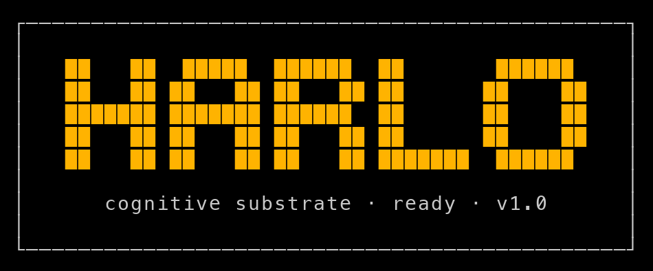
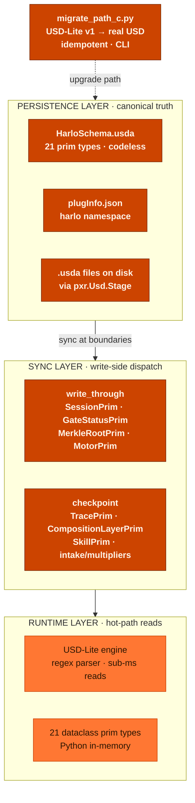
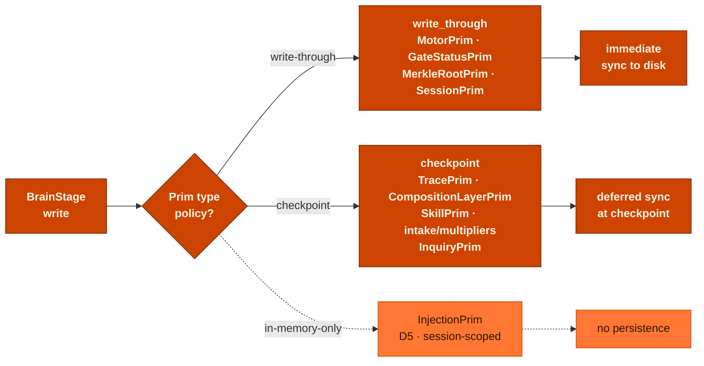
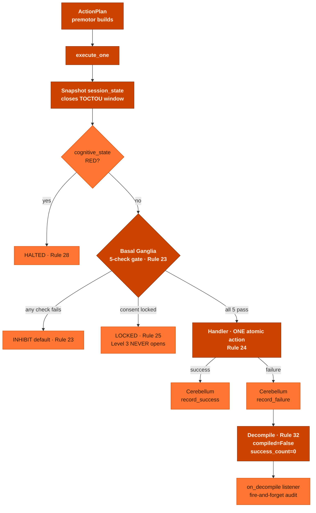
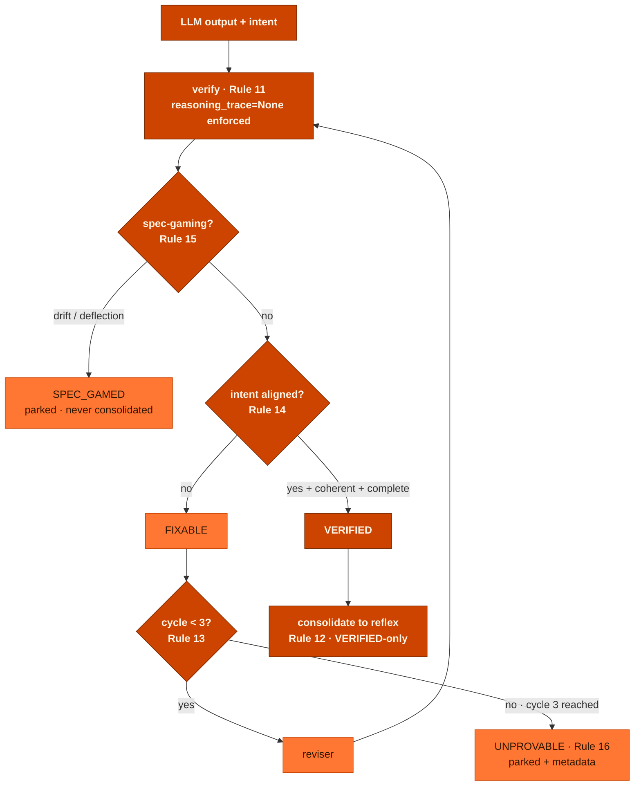
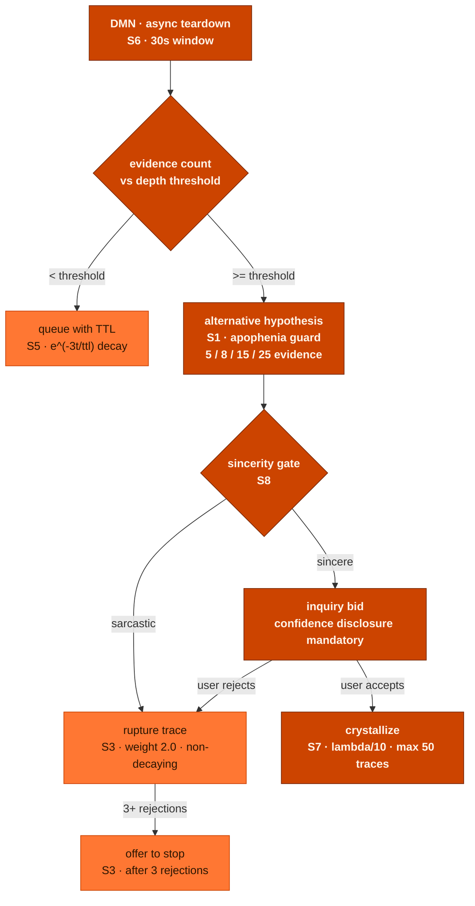
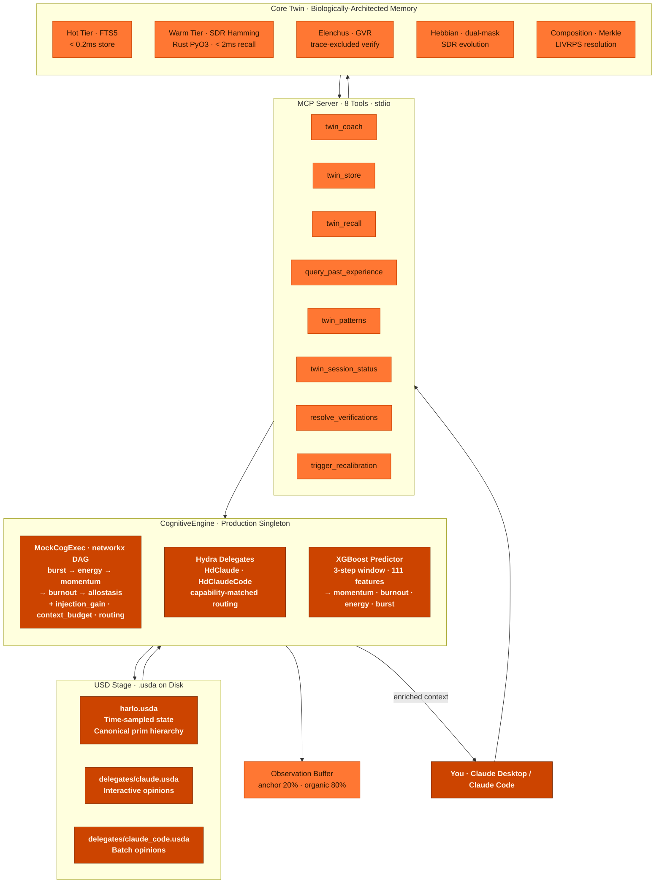
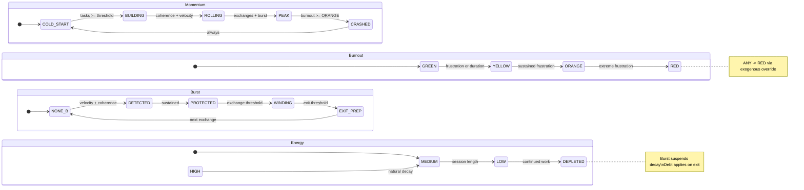
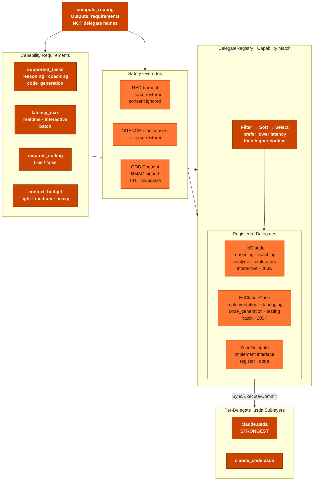
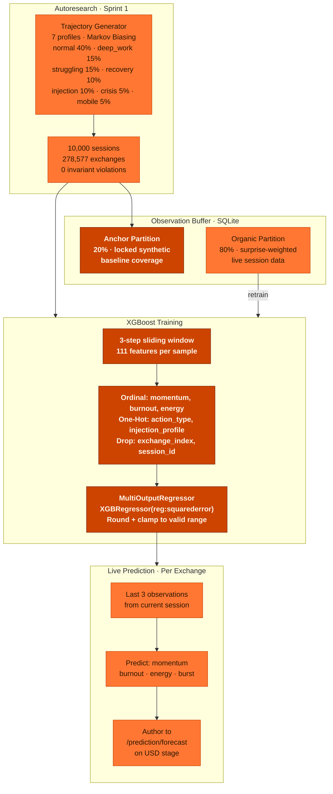

<p align="center">
  
</p>

<p align="center">
  
</p>

<p align="center">
  <strong>Patent Pending</strong> | <a href="LICENSE">Apache 2.0</a> | <a href="PATENTS.md">Patent Details</a>
</p>

---

Your AI coach. Watches your patterns, predicts your crashes, backs off during
flow, and tells you when to stop before you burn out. Built on USD composition
semantics for persistent, local-first cognitive state management.

Your memory, your device. Harlo stores all state locally as composable USD
layers — no cloud dependency, no data mining, no rented access to your own mind.

---

## Status

```
PRODUCTION LIVE — Harlo v6.0-MOTOR
Biological constraints (v3) · Elenchus GVR (v4) · Inquiry safeguards (v5) · Motor Cortex (v6)
33 inviolable rules · Real OpenUSD canonical persistence · USD-Lite runtime tier
Substrate-unified with sister project Moneta · P1 CIP defensible
8/8 phase gates passed · 19 D-block decisions clean (D1-D19) · Path C closed
```

| Sprint | Tests | What Shipped |
|--------|-------|-------------|
| **S1** State Machine | 84 | Pydantic schemas, MockCogExec DAG (networkx), 7 pure computation functions, 26-invariant validator, 10K synthetic trajectories via Profile-Driven Markov Biasing, XGBoost predictor (100% per-field accuracy), Bridge integration |
| **S2** OpenExec | -- | USD 26.03 built from source with `PXR_BUILD_EXEC=ON`. C++ Exec libraries compile. **Circuit-breaker triggered:** zero Python bindings in v26.03 source. MockCogExec continues to serve. |
| **S3** Hydra Delegates | 85 | HdCognitiveDelegate ABC, DelegateRegistry (capability matching), HdClaude + HdClaudeCode, compute_routing (requirements not names), OOB consent tokens (HMAC-signed, TTL), sublayer-per-delegate concurrency, CognitiveEngine singleton, 20-exchange e2e |
| **S4** Real USD | 59 | CognitiveStage wrapping `pxr.Usd.Stage`, stage_factory toggle, `.usda` files on disk with time-sampled CognitiveObservation, delegate sublayer `.usda` files, backend parity verified (mock = real USD) |
| **S5** Production | 22 | Graceful degradation (independent failure isolation), health check endpoint, kill switches (`ENGINE_ENABLED`, `USE_REAL_USD`, `OBSERVATION_LOGGING`, `PREDICTION_ENABLED`), first session verified, production docs |
| **Path C** Step 3 v3.4.0 | +39 | Real OpenUSD as canonical persistence (codeless schema, 21 prim types under `harlo` plugin separate from Moneta); USD-Lite engine preserved as fast in-memory runtime tier (Fabric pattern); sync layer per D4 policy table; migration script for USD-Lite v1 → real USD; substrate-unified with sister project Moneta. P1 CIP framing now defensible. |
| **v4.0** Elenchus | +18 | Trace-excluded `verify()` (Rule 11), 3-cycle GVR loop with FIXABLE→UNPROVABLE promotion (Rule 13), spec-gaming detection (Rule 15), intent preservation (Rule 14), VERIFIED-only consolidation (Rule 12). UNPROVABLE is dignified — first-class state with metadata (Rule 16). |
| **v5.0** Inquiry / DMN | +24 | Apophenia guard with depth-tiered evidence threshold (S1), epistemological bypass (S2), rupture & repair on rejection (S3), utility-mode DMN muting (S4), inquiry apoptosis (S5), DMN async teardown window (S6), trace crystallization (S7), sincerity gate (S8). |
| **v6.0** Motor Cortex | +14 | Inhibition-default Basal Ganglia gate (Rule 23) — five checks, INHIBIT-default. ONE atomic action at a time (Rule 24). Level 3 LOCKED never opens (Rule 25). RED kills motor (Rule 28). Reversibility cap (Rule 29). Single failure = instant de-compilation with `success_count=0` reset (Rule 32). Preemption uses `/dev/shm/`, never SQLite (Rule 30). |

---

## Architecture · Path C (Fabric Pattern)

v3.4.0-path-c introduced **codeless OpenUSD schemas** as canonical
persistence while preserving the existing USD-Lite engine as a fast
in-memory runtime tier. Path C — the **Fabric pattern** — separates
the two tiers so each can win at what it's good at: real OpenUSD owns
durability and patent claims; USD-Lite owns hot-path latency.

### Fabric pattern


```mermaid
flowchart TB
    subgraph PERSISTENCE["PERSISTENCE LAYER · canonical truth"]
        SCHEMA["HarloSchema.usda<br/>21 prim types · codeless"]:::substrate
        PLUG["plugInfo.json<br/>harlo namespace"]:::substrate
        DISK[".usda files on disk<br/>via pxr.Usd.Stage"]:::substrate
    end

    subgraph SYNCLAYER["SYNC LAYER · write-side dispatch"]
        WT["write_through<br/>SessionPrim · GateStatusPrim<br/>MerkleRootPrim · MotorPrim"]:::substrate
        CP["checkpoint<br/>TracePrim · CompositionLayerPrim<br/>SkillPrim · intake/multipliers"]:::substrate
    end

    subgraph RUNTIME["RUNTIME LAYER · hot-path reads"]
        ENGINE["USD-Lite engine<br/>regex parser · sub-ms reads"]:::runtime
        DC["21 dataclass prim types<br/>Python in-memory"]:::runtime
    end

    MIG["migrate_path_c.py<br/>USD-Lite v1 → real USD<br/>idempotent · CLI"]:::substrate

    PERSISTENCE -->|"sync at boundaries"| SYNCLAYER
    SYNCLAYER --> RUNTIME
    MIG -.->|"upgrade path"| PERSISTENCE

    classDef substrate fill:#CC4400,stroke:#7A2900,color:#FFF4E6,font-weight:bold
    classDef runtime fill:#FF7733,stroke:#CC4400,color:#2D1500
```

The persistence layer is the canonical truth. The runtime layer is the
fast tier that tests and live sessions exercise. The sync layer routes
mutations between them based on a per-prim policy table. Reads always
hit the runtime tier; persistence is touched only at sync boundaries
(Constitution Law 4).

The `[substrate]` extra activates the persistence layer:

```bash
pip install -e .[substrate]   # Pulls usd-core 26.5; activates persistence/
```

Core Harlo runs without `[substrate]` — `pxr` stays optional per
Constitution Law 3.

### Schema · IsA hierarchy

The codeless schema in `schema/HarloSchema.usda` declares 21 prim types
in a 3-tier IsA hierarchy parallel to containment (D2):


```mermaid
flowchart TB
    Typed["Typed · USD root"]:::substrate

    HP["HarloPrim · abstract"]:::substrate
    HC["HarloContainer · abstract"]:::substrate

    Typed --> HP
    HP --> HC

    BS["BrainStage"]:::substrate
    AP["AssociationPrim"]:::substrate
    CP["CompositionPrim"]:::substrate
    EP["ElenchusPrim"]:::substrate
    ICP["InquiryContainerPrim"]:::substrate
    MCP["MotorContainerPrim"]:::substrate
    SCP["SkillsContainerPrim"]:::substrate
    CPP["CognitiveProfilePrim"]:::substrate

    HC --> BS
    HC --> AP
    HC --> CP
    HC --> EP
    HC --> ICP
    HC --> MCP
    HC --> SCP
    HC --> CPP

    TP["TracePrim"]:::runtime
    CLP["CompositionLayerPrim"]:::runtime
    GSP["GateStatusPrim"]:::runtime
    MRP["MerkleRootPrim"]:::runtime
    SP["SessionPrim"]:::runtime
    IP["InquiryPrim"]:::runtime
    MP["MotorPrim"]:::runtime
    SkP["SkillPrim"]:::runtime
    MuP["MultipliersPrim"]:::runtime
    IHP["IntakeHistoryPrim"]:::runtime

    HP --> TP
    HP --> CLP
    HP --> GSP
    HP --> MRP
    HP --> SP
    HP --> IP
    HP --> MP
    HP --> SkP
    HP --> MuP
    HP --> IHP

    APIB["APISchemaBase · USD"]:::substrate
    PROV["Provenance · applied API"]:::substrate
    APIB --> PROV
    PROV -.->|"attaches to"| CLP

    classDef substrate fill:#CC4400,stroke:#7A2900,color:#FFF4E6,font-weight:bold
    classDef runtime fill:#FF7733,stroke:#CC4400,color:#2D1500
```

- **Two abstract bases:** `HarloPrim` (root of every Harlo type) and
  `HarloContainer` (parent of structural composites).
- **Eight concrete container types:** `BrainStage` plus seven subsystem
  containers (Association, Composition, Elenchus, Inquiry, Motor,
  Skills, CognitiveProfile).
- **Ten concrete leaf types** holding the actual cognitive-state
  attributes.
- **One singleApply API schema** (`Provenance`, per D10) that attaches
  origin metadata to host prims without cluttering the IsA tree.

Five enum types use lower-case `allowedTokens` per Constitution Cmd 11:
`SourceType`, `VerificationState`, `RetrievalPath`, `MotorGateStatus`,
`ArcType`. Cross-plugin: zero collisions with sister project Moneta's
`MonetaMemory` typeName (D3 verified).

### Sync layer · per-prim policy

The sync layer at `python/harlo/sync/` routes writes per the D4 policy
table:


```mermaid
flowchart LR
    START["BrainStage<br/>write"]:::substrate
    DECISION{"Prim type<br/>policy?"}:::substrate

    WT["write_through<br/>MotorPrim · GateStatusPrim<br/>MerkleRootPrim · SessionPrim"]:::substrate
    CP["checkpoint<br/>TracePrim · CompositionLayerPrim<br/>SkillPrim · intake/multipliers<br/>InquiryPrim"]:::substrate
    INMEM["InjectionPrim<br/>D5 · session-scoped"]:::runtime

    OUT_WT["immediate<br/>sync to disk"]:::substrate
    OUT_CP["deferred sync<br/>at checkpoint"]:::substrate
    OUT_INMEM["no persistence"]:::runtime

    START --> DECISION
    DECISION -->|"write-through"| WT
    DECISION -->|"checkpoint"| CP
    DECISION -.->|"in-memory-only"| INMEM
    WT --> OUT_WT
    CP --> OUT_CP
    INMEM -.-> OUT_INMEM

    classDef substrate fill:#CC4400,stroke:#7A2900,color:#FFF4E6,font-weight:bold
    classDef runtime fill:#FF7733,stroke:#CC4400,color:#2D1500
```

- **write_through** — synchronous persistence on every mutation. Used
  for consistency-critical prims (`SessionPrim`, `GateStatusPrim`,
  `MerkleRootPrim`) and the safety-critical `MotorPrim` (D4 ruling).
- **checkpoint** — deferred persistence; callers mark prim paths dirty
  during the session and flush explicitly. Used for high-write-rate
  prims to keep per-mutation persistence cost bounded.
- **In-memory only** — `InjectionPrim` is session-scoped per D5
  (evicted from disk; runtime dataclass retained for `/inject` command
  flows).

Containers inherit policy from their dominant child type. The migration
script (`python/harlo/migrate_path_c.py`) converts existing USD-Lite
text-format captures to real-USD format; read-tolerant on input,
idempotent on already-migrated files.

---

## Tech Stack

- **USD 26.03** — Cognitive state stored in real `.usda` files. Time-sampled. Human-readable. Git-trackable. Sublayer composition via LIVRPS.
- **OpenExec** — C++ libs built, Python bindings deferred (Pixar hasn't shipped them yet). Architecture is OpenExec-native; implementation catches up later.
- **Hydra Delegates** — The `Hd` prefix is a naming convention, not an import. Pure Python. Any LLM implements the interface, registers, done.
- **XGBoost** — MultiOutputRegressor predicting momentum, burnout, energy, burst from 111-feature sliding window. Trained on 10K synthetic trajectories (278K exchanges).
- **Python 3.12** (USD) / **3.14** (project) — Dual venv. Real USD on 3.12, graceful mock fallback on 3.14.
- **Rust** — Hippocampus crate via PyO3. 1-bit SDR encoding, XOR popcount kNN, lazy decay. Sub-2ms recall.
- **MCP** — 8 tools over stdio. Works with Claude Desktop, Claude Code, any MCP client.

---

## Architecture · Motor Cortex (v6.0-MOTOR)

The Motor Cortex executes ONE atomic action at a time through an
inhibition-default Basal Ganglia gate. The gate defaults to INHIBIT;
all five checks must pass, and Level 3 (LOCKED) never opens.


```mermaid
flowchart TB
    PLAN["ActionPlan<br/>premotor builds"]:::substrate
    EXEC["execute_one"]:::substrate
    SNAP["Snapshot session_state<br/>closes TOCTOU window"]:::substrate
    RED{"cognitive_state<br/>RED?"}:::runtime
    HALT["HALTED · Rule 28"]:::runtime
    BG{"Basal Ganglia<br/>5-check gate · Rule 23"}:::substrate
    INHIBIT["INHIBIT default · Rule 23"]:::runtime
    LOCKED["LOCKED · Rule 25<br/>Level 3 NEVER opens"]:::runtime
    HANDLER["Handler · ONE atomic action<br/>Rule 24"]:::substrate
    CB_S["Cerebellum<br/>record_success"]:::runtime
    CB_F["Cerebellum<br/>record_failure"]:::runtime
    DC["Decompile · Rule 32<br/>compiled=False<br/>success_count=0"]:::substrate
    HOOK["on_decompile listener<br/>fire-and-forget audit"]:::runtime

    PLAN --> EXEC --> SNAP --> RED
    RED -->|"yes"| HALT
    RED -->|"no"| BG
    BG -->|"all 5 pass"| HANDLER
    BG -->|"any check fails"| INHIBIT
    BG -->|"consent locked"| LOCKED
    HANDLER -->|"success"| CB_S
    HANDLER -->|"failure"| CB_F --> DC --> HOOK

    classDef substrate fill:#CC4400,stroke:#7A2900,color:#FFF4E6,font-weight:bold
    classDef runtime fill:#FF7733,stroke:#CC4400,color:#2D1500
```

The five checks are **anchor**, **consent**, **elenchus state**,
**reversibility**, and **scope** — every action requires every check
to pass; one failure inhibits. Reflexes skip planning but never skip
the gate (Rule 26). Single failure de-compiles instantly and resets
`success_count` to 0; the prior count is captured by the
`on_decompile` listener payload (audit trail), never by leaving stale
counters on the pattern itself. Preemption during DMN teardown writes
to `/dev/shm/`, never to SQLite (Rule 30).

---

## Architecture · Elenchus GVR (v4.0-ELENCHUS)

Elenchus is the verification engine. The verifier is **trace-excluded**
by build-time contract: `verify(reasoning_trace=None)` raises
`ValueError` immediately if the trace argument is anything other than
`None` (Rule 11). The loop is bounded at 3 cycles; FIXABLE outputs
that fail to revise within the budget become **UNPROVABLE** — a
dignified, first-class terminal state with metadata, not a failure.


```mermaid
flowchart TB
    OUT["LLM output + intent"]:::substrate
    V["verify · Rule 11<br/>reasoning_trace=None enforced"]:::substrate
    SG{"spec-gaming?<br/>Rule 15"}:::substrate
    SPEC["SPEC_GAMED<br/>parked · never consolidated"]:::runtime
    INT{"intent aligned?<br/>Rule 14"}:::substrate
    FX["FIXABLE"]:::runtime
    OK["VERIFIED"]:::substrate
    CYCLE{"cycle &lt; 3?<br/>Rule 13"}:::substrate
    REVISE["reviser"]:::runtime
    UN["UNPROVABLE · Rule 16<br/>parked + metadata"]:::runtime
    CONS["consolidate to reflex<br/>Rule 12 · VERIFIED-only"]:::substrate

    OUT --> V --> SG
    SG -->|"drift / deflection"| SPEC
    SG -->|"no"| INT
    INT -->|"no"| FX
    INT -->|"yes + coherent + complete"| OK
    FX --> CYCLE
    CYCLE -->|"yes"| REVISE --> V
    CYCLE -->|"no · cycle 3 reached"| UN
    OK --> CONS

    classDef substrate fill:#CC4400,stroke:#7A2900,color:#FFF4E6,font-weight:bold
    classDef runtime fill:#FF7733,stroke:#CC4400,color:#2D1500
```

Only **VERIFIED** resolutions become reflexes (Rule 12). FIXABLE,
SPEC_GAMED, and UNPROVABLE never consolidate — the build fails if an
unverified resolution leaks to the reflex cache. The Bridge checks
that the output answers the original intent (Rule 14), not a reframed
easier question — spec-gaming detection (Rule 15) catches the
correct-answer-to-wrong-question failure mode that dominates this
class of bug.

---

## Architecture · Inquiry / DMN (v5.0-INQUIRY)

The Default Mode Network synthesises patterns *between* sessions
during the daemon teardown window. Inquiry safeguards prevent the
classic LLM-as-pattern-detector failure modes: false positives
(apophenia), insincere agreement, and unbounded inquisitiveness after
rejection.


```mermaid
flowchart TB
    DMN["DMN · async teardown<br/>S6 · 30s window"]:::substrate
    EVID{"evidence count<br/>vs depth threshold"}:::substrate
    QUEUE["queue with TTL<br/>S5 · e^(-3t/ttl) decay"]:::runtime
    ALT["alternative hypothesis<br/>S1 · apophenia guard<br/>5 / 8 / 15 / 25 evidence"]:::substrate
    SINC{"sincerity gate<br/>S8"}:::substrate
    RUP["rupture trace<br/>S3 · weight 2.0 · non-decaying"]:::runtime
    BID["inquiry bid<br/>confidence disclosure mandatory"]:::substrate
    CRYST["crystallize<br/>S7 · lambda/10 · max 50 traces"]:::substrate
    STOP["offer to stop<br/>S3 · after 3 rejections"]:::runtime

    DMN --> EVID
    EVID -->|"&lt; threshold"| QUEUE
    EVID -->|">= threshold"| ALT --> SINC
    SINC -->|"sarcastic"| RUP
    SINC -->|"sincere"| BID
    BID -->|"user accepts"| CRYST
    BID -->|"user rejects"| RUP
    RUP -->|"3+ rejections"| STOP

    classDef substrate fill:#CC4400,stroke:#7A2900,color:#FFF4E6,font-weight:bold
    classDef runtime fill:#FF7733,stroke:#CC4400,color:#2D1500
```

Self-reported traces consumed by Inquiry bypass Elenchus (S2 —
Inquiry verifies tone + boundaries, not objective truth);
Composition-bound consumers still get standard verification.
Crystallization (S7) protects emerging patterns below the apophenia
threshold by reducing their decay rate to `λ/10`. When Elenchus
falsifies a self-reported claim, a `perception_gap` trace is emitted
(Rule 20); if the user rejects the inquiry, the claim is tagged
`blind_spot_accepted` (Rule 33) — claim-specific, not categorical.

---

## Architecture

### System Layers


```mermaid
graph TB
    USER["You · Claude Desktop / Claude Code"]:::substrate

    subgraph MCP["MCP Server · 8 Tools · stdio"]
        direction LR
        COACH["twin_coach"]:::runtime
        STORE["twin_store"]:::runtime
        RECALL["twin_recall"]:::runtime
        QPE["query_past_experience"]:::runtime
        PATTERNS["twin_patterns"]:::runtime
        SESSION["twin_session_status"]:::runtime
        RESOLVE["resolve_verifications"]:::runtime
        RECAL["trigger_recalibration"]:::runtime
    end

    subgraph ENGINE["CognitiveEngine · Production Singleton"]
        direction TB
        DAG["MockCogExec · networkx DAG<br/>burst → energy → momentum<br/>→ burnout → allostasis<br/>+ injection_gain · context_budget · routing"]:::substrate
        DELEGATES["Hydra Delegates<br/>HdClaude · HdClaudeCode<br/>capability-matched routing"]:::substrate
        PREDICT["XGBoost Predictor<br/>3-step window · 111 features<br/>→ momentum · burnout · energy · burst"]:::substrate
    end

    subgraph STAGE["USD Stage · .usda on Disk"]
        direction LR
        ROOT["harlo.usda<br/>Time-sampled state<br/>Canonical prim hierarchy"]:::substrate
        CLAUDE_SUB["delegates/claude.usda<br/>Interactive opinions"]:::substrate
        CODE_SUB["delegates/claude_code.usda<br/>Batch opinions"]:::substrate
    end

    subgraph MEMORY["Core Twin · Biologically-Architected Memory"]
        direction TB
        HOT["Hot Tier · FTS5<br/>&lt; 0.2ms store"]:::runtime
        WARM["Warm Tier · SDR Hamming<br/>Rust PyO3 · &lt; 2ms recall"]:::runtime
        ELENCHUS["Elenchus · GVR<br/>trace-excluded verify"]:::runtime
        HEBBIAN["Hebbian · dual-mask<br/>SDR evolution"]:::runtime
        COMPOSITION["Composition · Merkle<br/>LIVRPS resolution"]:::runtime
    end

    BUFFER["Observation Buffer<br/>anchor 20% · organic 80%"]:::runtime

    USER --> MCP
    MCP --> ENGINE
    ENGINE --> STAGE
    ENGINE --> BUFFER
    STAGE --> ENGINE
    MCP --> MEMORY
    MEMORY --> MCP
    ENGINE -->|"enriched context"| USER

    classDef substrate fill:#CC4400,stroke:#7A2900,color:#FFF4E6,font-weight:bold
    classDef runtime fill:#FF7733,stroke:#CC4400,color:#2D1500
```

### Exchange Loop

Every MCP tool call flows through this 7-step pipeline:


```mermaid
graph LR
    CALL["MCP Tool Call"]:::runtime

    subgraph PIPELINE["CognitiveEngine · Per-Exchange Pipeline"]
        direction LR
        S1["1 · Author<br/>Build observation<br/>from tool context"]:::substrate
        S2["2 · Evaluate<br/>DAG: burst → energy<br/>→ momentum → burnout<br/>→ allostasis"]:::substrate
        S3["3 · Route<br/>compute_routing →<br/>capability requirements"]:::substrate
        S4["4 · Delegate<br/>Sync → Execute<br/>→ CommitResources<br/>to sublayer"]:::substrate
        S5["5 · Observe<br/>Emit to buffer<br/>anchor/organic split"]:::substrate
        S6["6 · Predict<br/>XGBoost forecast<br/>author to /prediction"]:::substrate
        S7["7 · Save<br/>.usda to disk<br/>graceful on failure"]:::substrate
        S1 --> S2 --> S3 --> S4 --> S5 --> S6 --> S7
    end

    RESPONSE["Enriched Response<br/>cognitive_context<br/>delegate_id · expert<br/>prediction"]:::runtime

    CALL --> PIPELINE --> RESPONSE

    classDef substrate fill:#CC4400,stroke:#7A2900,color:#FFF4E6,font-weight:bold
    classDef runtime fill:#FF7733,stroke:#CC4400,color:#2D1500
```

### Cognitive State Machines

Five state machines evaluated via topologically-sorted DAG on every exchange:


```mermaid
%%{init: {'themeVariables': {'primaryColor': '#CC4400', 'primaryTextColor': '#FFF4E6', 'primaryBorderColor': '#7A2900', 'lineColor': '#7A2900', 'secondaryColor': '#FF7733', 'tertiaryColor': '#FFB870'}}}%%
stateDiagram-v2
    direction LR

    state Momentum {
        direction LR
        [*] --> COLD_START
        CRASHED --> COLD_START: always
        COLD_START --> BUILDING: tasks >= threshold
        BUILDING --> ROLLING: coherence + velocity
        ROLLING --> PEAK: exchanges + burst
        PEAK --> CRASHED: burnout >= ORANGE
    }

    state Burnout {
        direction LR
        [*] --> GREEN
        GREEN --> YELLOW: frustration or duration
        YELLOW --> ORANGE: sustained frustration
        ORANGE --> RED: extreme frustration
        note right of RED: ANY -> RED via exogenous override
    }

    state Energy {
        direction LR
        [*] --> MEDIUM
        HIGH --> MEDIUM: natural decay
        MEDIUM --> LOW: session length
        LOW --> DEPLETED: continued work
        note right of DEPLETED: Burst suspends decay\nDebt applies on exit
    }

    state Burst {
        direction LR
        [*] --> NONE_B
        NONE_B --> DETECTED: velocity + coherence
        DETECTED --> PROTECTED: sustained
        PROTECTED --> WINDING: exchange threshold
        WINDING --> EXIT_PREP: exit threshold
        EXIT_PREP --> NONE_B: next exchange
    }
```

### Hydra Delegate Pattern

The DAG outputs what's needed. The registry selects who fulfills it. The DAG never names a specific LLM.


```mermaid
graph TB
    ROUTING["compute_routing<br/>Outputs: requirements<br/>NOT delegate names"]:::substrate

    subgraph REQUIREMENTS["Capability Requirements"]
        direction LR
        REQ_TASKS["supported_tasks<br/>reasoning · coaching<br/>code_generation"]:::substrate
        REQ_LATENCY["latency_max<br/>realtime · interactive<br/>batch"]:::substrate
        REQ_CODING["requires_coding<br/>true / false"]:::substrate
        REQ_CTX["context_budget<br/>light · medium · heavy"]:::substrate
    end

    subgraph SAFETY["Safety Overrides"]
        direction LR
        RED["RED burnout<br/>→ force restorer<br/>consent ignored"]:::runtime
        ORANGE["ORANGE + no consent<br/>→ force restorer"]:::runtime
        CONSENT["OOB Consent<br/>HMAC-signed<br/>TTL · revocable"]:::runtime
    end

    subgraph REGISTRY["DelegateRegistry · Capability Match"]
        direction TB
        MATCH["Filter → Sort → Select<br/>prefer lower latency<br/>then higher context"]:::substrate

        subgraph DELEGATES["Registered Delegates"]
            direction LR
            CLAUDE["HdClaude<br/>reasoning · coaching<br/>analysis · exploration<br/>interactive · 200K"]:::runtime
            CODE["HdClaudeCode<br/>implementation · debugging<br/>code_generation · testing<br/>batch · 200K"]:::runtime
            FUTURE["Your Delegate<br/>implement interface<br/>register · done"]:::runtime
        end
    end

    subgraph SUBLAYERS["Per-Delegate .usda Sublayers"]
        direction LR
        SUB_C["claude.usda<br/>STRONGEST"]:::substrate
        SUB_CC["claude_code.usda"]:::substrate
    end

    ROUTING --> REQUIREMENTS
    ROUTING --> SAFETY
    REQUIREMENTS --> REGISTRY
    SAFETY --> REGISTRY
    MATCH --> DELEGATES
    DELEGATES -->|"Sync/Execute/Commit"| SUBLAYERS

    classDef substrate fill:#CC4400,stroke:#7A2900,color:#FFF4E6,font-weight:bold
    classDef runtime fill:#FF7733,stroke:#CC4400,color:#2D1500
```

### Prediction Pipeline

From synthetic autoresearch to live organic observations:


```mermaid
graph TB
    subgraph SYNTHETIC["Autoresearch · Sprint 1"]
        direction TB
        GEN["Trajectory Generator<br/>7 profiles · Markov Biasing<br/>normal 40% · deep_work 15%<br/>struggling 15% · recovery 10%<br/>injection 10% · crisis 5% · mobile 5%"]:::runtime
        TRAJ["10,000 sessions<br/>278,577 exchanges<br/>0 invariant violations"]:::runtime
        GEN --> TRAJ
    end

    subgraph BUFFER["Observation Buffer · SQLite"]
        direction LR
        ANCHOR["Anchor Partition<br/>20% · locked synthetic<br/>baseline coverage"]:::substrate
        ORGANIC["Organic Partition<br/>80% · surprise-weighted<br/>live session data"]:::runtime
    end

    subgraph TRAINING["XGBoost Training"]
        direction TB
        WINDOW["3-step sliding window<br/>111 features per sample"]:::substrate
        ENCODE["Ordinal: momentum, burnout, energy<br/>One-Hot: action_type, injection_profile<br/>Drop: exchange_index, session_id"]:::substrate
        MODEL["MultiOutputRegressor<br/>XGBRegressor(reg:squarederror)<br/>Round + clamp to valid range"]:::substrate
        WINDOW --> ENCODE --> MODEL
    end

    subgraph LIVE["Live Prediction · Per Exchange"]
        direction TB
        OBS_WIN["Last 3 observations<br/>from current session"]:::runtime
        PRED["Predict: momentum<br/>burnout · energy · burst"]:::runtime
        AUTHOR["Author to<br/>/prediction/forecast<br/>on USD stage"]:::runtime
        OBS_WIN --> PRED --> AUTHOR
    end

    TRAJ --> ANCHOR
    TRAJ --> TRAINING
    ORGANIC -->|"retrain"| TRAINING
    MODEL --> LIVE

    classDef substrate fill:#CC4400,stroke:#7A2900,color:#FFF4E6,font-weight:bold
    classDef runtime fill:#FF7733,stroke:#CC4400,color:#2D1500
```

---

## Graceful Degradation

Every component fails independently. The MCP server never crashes.

| Component Failure | Fallback | Logged |
|-------------------|----------|--------|
| USD import fails | MockUsdStage (dict) | WARNING |
| Model file missing | Prediction disabled | WARNING |
| DB locked | Memory queue (max 100) | WARNING |
| DAG evaluation fails | Default computed values | ERROR |
| Delegate cycle fails | Empty context returned | ERROR |
| Stage save fails | Queued for next exchange | WARNING |
| Engine disabled | Pre-Sprint 3 MCP behavior | -- |

---

## Project Structure

```
src/                               Cognitive State Machine + Production Engine
├── cognitive_engine.py            Production singleton: DAG → route → delegate → observe → predict
├── cognitive_stage.py             Real pxr.Usd.Stage wrapper (.usda on disk)
├── mock_usd_stage.py              Dict-based fallback stage
├── stage_factory.py               Backend toggle: USE_REAL_USD
├── mock_cogexec.py                networkx DAG evaluator (topological sort)
├── schemas.py                     Pydantic IntEnum ordinals + CognitiveObservation
├── delegate_base.py               HdCognitiveDelegate ABC (Hydra pattern)
├── delegate_registry.py           Capability-matching selection
├── delegate_claude.py             Interactive reasoning delegate
├── delegate_claude_code.py        Implementation/code delegate
├── consent.py                     OOB consent tokens (HMAC, TTL, revocable)
├── engine_config.py               Kill switches + paths
├── usd_bootstrap.py               USD 26.03 sys.path setup
├── computations/                  Pure functions (no internal counters)
│   ├── compute_momentum.py        CRASHED→COLD_START→BUILDING→ROLLING→PEAK
│   ├── compute_burnout.py         GREEN→YELLOW→ORANGE→RED + exogenous override
│   ├── compute_energy.py          Adrenaline masking, RED degradation, exercise recovery
│   ├── compute_injection_gain.py  Anchor = 1.0 ALWAYS (structural immunity)
│   ├── compute_context_budget.py  Hysteresis: promote >4.2x, demote <3.8x
│   ├── compute_burst.py           5-phase hyperfocus lifecycle
│   ├── compute_allostasis.py      6-weight composite + trend detection
│   └── compute_routing.py         Capability requirements (NOT delegate names)
├── trajectory_generator.py        10K sessions via Profile-Driven Markov Biasing
├── validator.py                   26 invariants (INV-01 to INV-26)
├── train_predictor.py             XGBoost MultiOutputRegressor
├── predict.py                     3-step window inference
├── bridge.py                      Exchange loop coordinator (simulation)
└── observation_buffer.py          SQLite priority queue (anchor 20% / organic 80%)

python/harlo/             Core Twin: MCP server + biologically-architected memory
├── mcp_server.py                  8 MCP tools over stdio
├── migrate_path_c.py              Path C migration script (USD-Lite v1 → real USD)
├── brainstem/                     Lossless translation (14 adapter files)
├── elenchus/                      Verification engine (GVR, trace-excluded)
├── elenchus_v8/                   Deferred verification (Actor-side)
├── composition/                   Merkle stages, LIVRPS resolution
├── hebbian/                       Dual-mask SDR evolution, reconstruction
├── hot_store/                     L1 Hot Tier (FTS5, zero-encoding)
├── modulation/                    Allostatic load, gain, burst detection
├── motor/                         Basal Ganglia gate (inhibit-default)
├── inquiry/                       DMN (apophenia guard, sincerity gate)
├── coach/                         System prompt projection
├── encoder/                       ONNX BGE + LSH → 2048-bit SDR
├── trust/                         Continuous [0,1] trust ledger
├── intake/                        Neuropsych-informed cognitive profile
├── skills/                        Incremental competence tracking
├── session/                       Session lifecycle management
├── sync/                          Path C sync layer (write-side dispatch)
│   ├── policy.py                  Per-prim policy table (D4)
│   ├── write_through.py           Synchronous persist strategy
│   └── checkpoint.py              Deferred-flush strategy
└── usd_lite/                      21 prim dataclasses, .usda serialization
    └── persistence/               Path C real-USD writer/reader
        ├── writer.py              BrainStage → real-USD .usda via pxr
        └── reader.py              real-USD .usda → BrainStage

schema/                            Path C codeless schema artifacts
├── HarloSchema.usda               21 prim types, IsA hierarchy, allowedTokens
├── plugInfo.json                  harlo namespace plugin registration
└── generatedSchema.usda           Compiled form (hand-authored)

crates/hippocampus/                Rust hot path (SDR, XOR search, lazy decay, apoptosis)

data/stages/                       Real .usda files (your cognitive state)
├── brain.usda                     Path C root stage (real-USD via pxr)
├── harlo.usda                     Sprint 4 root stage (vendored USD path)
└── delegates/                     Per-delegate sublayers

harness/path_c/                    Path C surgery harness (Mile 1 → Mile 3)
├── 01_KICKOFF.md, 02_CONSTITUTION.md, 03_HANDOFF.md, 04_DEEP_THINK_BRIEF.md
├── 05_DECISIONS.md (D1-D5), 06_DECISIONS_PHASE_1.md (D6-D14),
│   07_DECISIONS_PHASE_4.md (D15-D19)
├── blocker_decisions.md           Codec-blocker resolution log
├── memory_hypothesis.md, substrate_pin.md, baseline_resolution.md
├── tracking_issues.md             TI-001 (closed-on-arrival)
└── baseline_tests.txt, baseline_latency.json, phase_3_latency.json,
    phase_6_latency.json
```

---

## Quick Start

```bash
git clone <repo-url> && cd harlo
python3.12 -m venv .venv312 && source .venv312/bin/activate

# Core install (no real-USD persistence)
pip install -e .

# Path C real-USD persistence (optional, requires Python 3.12)
pip install -e .[substrate]      # Pulls usd-core 26.5

# Test-suite dev dependencies (sentence_transformers, anthropic, pytest)
pip install -e .[dev]

# Health check
python scripts/health_check.py

# First session (10-exchange simulation)
python scripts/first_session.py

# Migrate an existing USD-Lite stage to real-USD format (Path C)
python -m harlo.migrate_path_c data/stages/your_stage.usda --output data/stages/brain.usda
```

On Windows, if `pip install -e .[substrate]` fails on a `.pyd` file lock
during the maturin rebuild (D13 documented quirk), close any process
holding `python/harlo/hippocampus.cp312-win_amd64.pyd` open, or install
the substrate dep directly:

```bash
pip install "usd-core>=24.05"   # Same end state; bypasses editable rebuild
```

Environment variables:
```bash
ENGINE_ENABLED=1         # Master kill switch
USE_REAL_USD=1           # Real pxr.Usd.Stage (requires Python 3.12)
OBSERVATION_LOGGING=1    # Emit observations per exchange
PREDICTION_ENABLED=1     # XGBoost predictions
```

---

## The 33 Rules

The architecture is constrained by 33 inviolable rules organised into four
constitutional layers:

- **Biological constraints (v3.0, rules 1–10)** — 0W idle (socket activation,
  no polling), 1-bit SDR vectors with bitwise XOR / Hamming search, lazy
  decay (timestamp math at retrieval only), apoptosis (physical DELETE +
  VACUUM), Merkle composition, anchor immunity, JSON-schema barrier, and
  the allostatic-load formula.
- **Elenchus constraints (v4.0, rules 11–18)** — trace-excluded `verify()`
  (build fails if `reasoning_trace` leaks), VERIFIED-only consolidation,
  max 3 GVR cycles with FIXABLE → UNPROVABLE promotion, intent
  preservation, spec-gaming detection, dignified UNPROVABLE state, burst
  defers / RED overrides everything.
- **Inquiry safeguards (v5.0, rules S1–S8)** — apophenia guard with
  depth-tiered evidence thresholds, epistemological bypass, rupture &
  repair, utility-mode DMN muting, inquiry apoptosis, DMN async
  teardown window, trace crystallization, sincerity gate.
- **Motor Cortex constraints (v6.0, rules 19–33)** — teardown preemption,
  perception-gap traces, inhibition-default Basal Ganglia, ONE atomic
  action at a time, Level 3 LOCKED never opens, motor reflexes ALWAYS
  gated, RED kills motor, reversibility cap, preemption to `/dev/shm/`
  (never SQLite), action-plan persistence, motor-reflex zero-tolerance
  (`success_count=0` on decompile), blind-spot acceptance.

These aren't guidelines — they're structural constraints with
build-time and test-time enforcement. See `CLAUDE.md` for the full
specification and `harness/path_c/` for the Path C surgery harness
(D1–D19 decisions log, phase gate audits).

---

## Philosophy

**Your memory, your device.** Harlo stores all state locally as composable USD layers. Cloud models provide reasoning; your machine provides memory and safety. Nothing leaves your device without explicit action.

---

## License

Licensed under the [Apache License 2.0](LICENSE). Patent Pending.

Aspects of this architecture are the subject of pending US patent applications.
The Apache 2.0 license includes a patent grant for users of this software.
See [PATENTS.md](PATENTS.md) for details.
