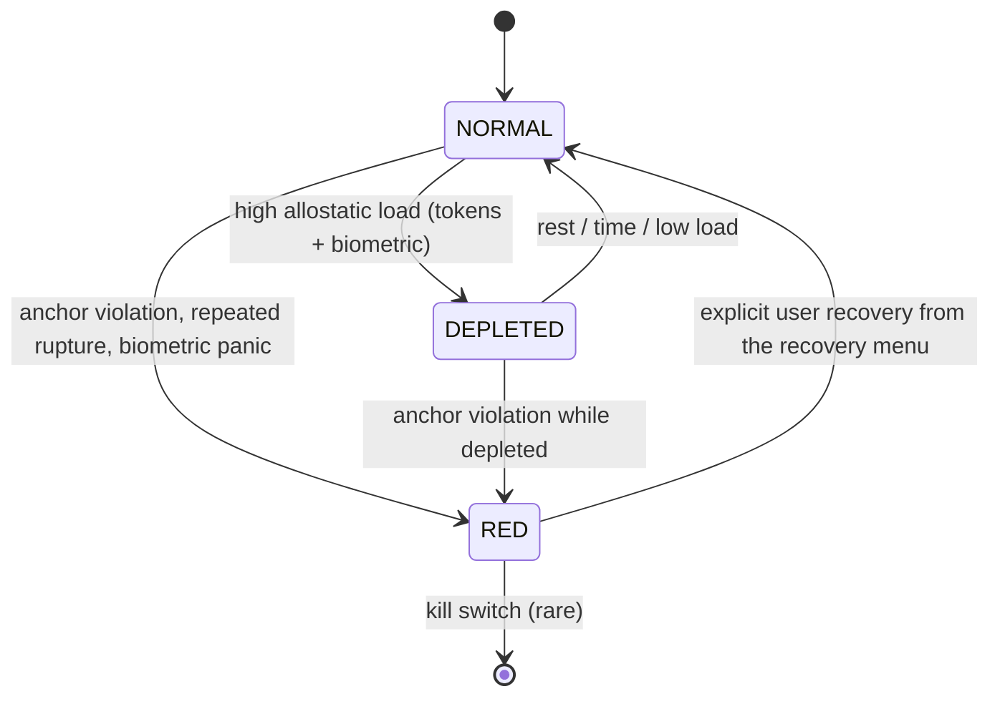

# Harlo — UX/UI Design Brief

> **Audience:** Claude Design (or any human designer) producing
> wireframes and a design system for the Harlo macOS 26.5 app.
> **Source of truth for product behavior:** `/CLAUDE.md` (33 rules).
> **Source of truth for architecture:** this document's glossary.
> Do not invent vocabulary or behavior not present here.

---

## 1. Product mental model (user-facing)

Harlo is a local AI coach that lives in your menu bar. Four pieces
the user is asked to understand:

| User-facing term | What it is for them |
|---|---|
| **Memory** | What Harlo remembers about you |
| **Reasoning** | How Harlo thinks through your situation |
| **Coach** | The voice that talks to you |
| **Guardian** | The part that refuses to do harmful or risky things |

That is the entire ontology a user needs. Everything else
(Elenchus, GVR, DMN, hippocampus, Merkle trees, anchors, reflexes)
is internal vocabulary and **must not appear in user copy**. It may
appear in the Advanced view, labeled and parenthesized.

## 2. Glossary — user-facing term → internal concept

| Surface term | Internal concept | File reference |
|---|---|---|
| Memory | Association hemisphere (Hippocampus + Hot Store) | `crates/hippocampus/`, `python/harlo/hot_store/` |
| Reasoning | Composition hemisphere + Elenchus verifier + Inquiry Engine (DMN) | `python/harlo/composition/`, `python/harlo/elenchus/`, `python/harlo/inquiry/` |
| Coach | `project_coach()` system-prompt projection of state | `python/harlo/coach/__init__.py` |
| Guardian | Bridge + Amygdala + Basal Ganglia | `python/harlo/motor/basal_ganglia.py` |
| "Tired mode" | DEPLETED cognitive state | Rule 9, Rule 27 |
| "Stop everything" | RED cognitive state | Rule 18, Rule 28 |
| "Quiet pattern" | Crystallized inquiry trace | S7 |
| "Coaching profile" | `CognitiveProfilePrim` | `python/harlo/usd_lite/prims.py` |
| Intake form | Initial questionnaire calibrating multipliers | `python/harlo/intake/` |
| HealthKit pane | Biometric barrier consent surface | `python/harlo/modulation/biometric_barrier.py` |
| Audit | Composition Merkle layers + reflex cache view | Rule 6 |

## 3. Cognitive state diagram

UI transitions allowed on each edge:

- `NORMAL → DEPLETED`: menu-bar icon dims to amber. Notifications
  silenced. Coach pane becomes lower-contrast. **No modal.**
- `DEPLETED → NORMAL`: icon returns to neutral. No notification.
- `NORMAL/DEPLETED → RED`: **full-screen modal recovery menu.** Nothing
  else clickable in Harlo. Other apps untouched.
- `RED → NORMAL`: only via explicit user action from the recovery menu.
  Never automatic.

**Forbidden** transitions (do not surface):

- Notification during DEPLETED → would force motor escalation (Rule 27).
- Auto-clearing RED on a timer → user must consent (Rule 18).
- Animated transitions during DEPLETED → reduced-motion always wins.

## 4. Five concrete user journeys

### J1 — First launch + intake

1. User opens `/Applications/Harlo.app` for the first time.
2. Menu-bar icon appears, neutral. A non-modal panel slides down from
   the menu bar offering "Take the 5-minute setup" and "Skip for now".
3. If "Take the setup": intake window opens. One question per screen,
   large type, single text field. Optional "I don't know" button under
   every question (maps to sincerity class `uncertain`).
4. After 6–8 questions, Harlo shows a "What I learned about you" screen
   summarizing the derived coaching profile in plain English. No
   numbers, no multipliers. User can confirm or restart.
5. On confirm: profile is persisted as a Composition Merkle layer with
   `Provenance.INTAKE_CALIBRATED`. Menu-bar icon stays neutral.
6. If "Skip for now": menu-bar item shows a small dot until intake is
   completed. Coach pane works with defaults.

### J2 — Daily coach interaction

1. User clicks menu-bar icon → Coach pane opens.
2. Single text input, no chat history visible by default (Memory pane
   is separate). User types a prompt, hits Enter, gets a coached
   response.
3. If the Inquiry Engine wants to surface a question (S1 satisfied,
   not in rupture cooldown S3, not DEPLETED), one gentle inquiry
   appears below the response. User can answer, dismiss, or
   "not now".
4. After 30 seconds idle the pane fades; daemon goes 0W.

### J3 — Rupture-and-repair

1. User dismisses an inquiry three times in a row.
2. Coach pane surfaces (one time only): "I keep asking about X.
   Would you like me to stop?" with **Stop** / **Keep asking** /
   **Ask differently**.
3. **Stop**: inquiry trace marked `blind_spot_accepted` (Rule 33);
   Harlo never re-surfaces this specific claim's gap inquiry.
4. **Keep asking**: rupture counter resets.
5. **Ask differently**: apophenia threshold for this inquiry adjusted;
   Harlo waits 90-day half-life cooldown.

### J4 — HealthKit consent + revocation

1. Settings → HealthKit pane.
2. Top of pane: **disclosure banner**: "Apple Watch data syncs to your
   Mac through your iPhone, usually within 5–20 minutes. Harlo uses
   this for slow trends like tiredness, not real-time alerts. This is
   an Apple limitation, not a Harlo one."
3. Below: per-data-type toggles (Heart Rate, HRV, Sleep, Activity,
   Workouts). Each toggle off by default. Toggling on triggers the
   macOS HealthKit consent dialog.
4. **Revoke**: a single "Disconnect HealthKit" button. Confirmation
   sheet: "This will unload HarloHealthBridge and delete the locally
   stored sync anchor. Your HealthKit data in Apple Health is not
   touched." On confirm: `launchctl unload` the bridge, delete
   `~/Library/Application Support/Harlo/healthkit_anchor.bin`.
5. After revoke, allostatic dashboard shows tokens-only mode, with a
   discrete "HealthKit off" badge.

### J5 — RED recovery menu

1. RED triggered (anchor violation, repeated rupture, or sustained
   biometric spike if HealthKit on).
2. Menu-bar icon becomes solid red, badge "!".
3. Clicking it opens a **modal recovery menu** covering the Harlo
   window (NOT the user's whole screen). Nothing else in Harlo is
   clickable.
4. Four options: **Pause Harlo** (24h timeout), **Restart fresh
   session** (preserves Memory, clears current Reasoning),
   **Show me what happened** (opens audit view scoped to the
   triggering event), **Talk to me** (limited Coach pane, motor
   actions disabled).
5. RED only clears by explicit user choice. No auto-clear.

## 5. Surfaces

### 5.1 Menu-bar icon — four states

| State | Icon | Color | Motion |
|---|---|---|---|
| Idle (NORMAL) | small filled circle | system label color | none |
| Working | circle with two rotating dots | system tint | gentle rotation, **paused under reduced-motion** |
| DEPLETED | open circle with amber outline | amber (`#D49B3F` light / `#E0A553` dark) | none |
| RED | filled red circle, "!" badge | true red (`#D70015`) | one-time pulse on entry, then static |

### 5.2 Intake window

- 640 × 560 px, resizable down to 480 × 420.
- One question, large headline type, single line input or 3-button
  picker depending on question type.
- "Back" and "I don't know" always available. "Skip" is **not**
  available — user must engage or quit.
- Progress shown as N of M, no percentage bar.
- Closes to system tray on user dismissal; can be resumed from
  menu bar.

### 5.3 Coach pane

- Single column, 480 × 720 px default.
- Top: single text input with placeholder "What's on your mind?"
- Below: Harlo's last response, plain text, monospace for any code
  blocks.
- Below that: at most one inquiry (gentle copy, two buttons:
  **answer** / **not now**).
- **No typing indicator.** Implies always-on daemon (Rule 1
  violation in spirit).
- **No streaks, no XP, no gamification.** Would convert anchors
  into reward signals (Rule 10).
- **No avatar.** Harlo is not a person.

### 5.4 Allostatic dashboard

- Accessed from menu-bar → "Show how I'm doing".
- Two cards: **Recent activity** (token velocity + prompt frequency,
  last hour, last day) and **From your Watch** (only if HealthKit
  permission granted).
- Every Watch metric shows a freshness timestamp ("3 min ago",
  "12 min ago", "stale — >20 min").
- **No real-time HR display in milliseconds.** Apple Watch latency
  is 5–20+ min; pretending otherwise is dishonest.
- Card color reflects cognitive state (neutral / amber / red).

### 5.5 HealthKit consent screen

Covered in J4. Two design requirements worth repeating:

- The latency disclaimer is **not collapsible**. It always shows
  above the toggles.
- The revoke button is the same visual weight as the connect
  toggles — not buried.

### 5.6 Advanced view

- Accessed via Settings → Advanced.
- Sections: **Audit** (Merkle layers with provenance), **Reflex
  cache**, **Inquiry queue**, **Compliance checks** (live `grep`
  results from CLAUDE.md), **Kill switch** (terminates daemon and
  bridge immediately).
- Internal vocabulary allowed here, parenthetically.

## 6. Interaction laws (verbatim from the 33 rules)

- **RED state overrides everything.** No GVR, no inquiry, no motor.
  Recovery menu only. (Rule 18, 28)
- **One motor action at a time.** No automatic chaining of actions
  in the UI. (Rule 24)
- **Level 3 motor actions never have a confirm; the gate doesn't
  open.** (Rule 25) UI must distinguish: Level 1 (no confirm),
  Level 2 (confirm sheet), Level 3 (grayed out with explanation).
- **DEPLETED downgrades motor.** Level 1 becomes Level 2 visually.
  (Rule 27)
- **Three rejections of an inquiry → "want me to stop?"** prompt.
  (S3 — section 4 of CLAUDE.md)
- **Sincerity gate** — never tag sarcastic user input as ground
  truth. Re-prompt for clarity, don't punish. (S8)
- **Sincerity uncertain** — show "I don't know" as a first-class
  option, not a hidden affordance. (S8)
- **Trust the user by default.** (S8 closing line)

## 7. Rejected designs (and why)

| Design | Reason rejected |
|---|---|
| Notification during DEPLETED | Forces motor escalation; violates Rule 27 |
| Streaks / XP / gamification | Converts anchors into reward signals; violates Rule 10 |
| Chat "typing…" indicator | Implies always-on daemon; misaligns with Rule 1 |
| Anthropomorphizing avatar | Harlo is not a person; honesty is a feature |
| Progress bars during DMN synthesis | Foregrounds a 0W-idle daemon; violates Rule 1 in spirit |
| Real-time HR in milliseconds | Watch → Mac latency is 5–20+ min; dishonest |
| Auto-clearing RED on timer | User must consent; violates Rule 18 |
| Onboarding tour over the entire UI | Aggressive; users opt into intake instead |
| Daily reminders / habit nudges | Treats user as someone to manage, not partner |

## 8. Decision authority

| Change | Authority |
|---|---|
| Color tokens, font sizing, icon design | Designer ships unilaterally |
| Surface layout, copy wording | Designer ships, Architect role reviews |
| State transitions, new modals, new surfaces | Architect role must approve (rule-adjacent) |
| Any UI for biometric data | Architect role must approve (Rule 9) |
| Any UI that bypasses a confirm sheet | Architect role must approve (Rule 23–25) |
| Recovery menu copy or options | Architect role must approve (Rule 18) |

## 9. Do-not-do list

- No anthropomorphizing avatar.
- No "typing…" indicator.
- No streaks / XP / leaderboards / shared progress.
- No progress bars during DMN synthesis.
- No real-time HR readout in seconds or milliseconds.
- No auto-clearing of RED state.
- No notifications during DEPLETED.
- No third-party analytics, tracking, telemetry of any kind.
- No "share to social" buttons.
- No "premium" tiers in the UI.

## 10. Tone, color, motion, accessibility, privacy

### Tone & copy
- Present, plain, never therapeutic-jargon.
- Twin voice is honest mirroring, not validation.
- Never address the user by an inferred identity. Use second person
  ("you"), never third person.
- Error states: name what happened, what Harlo did about it, what
  the user can do.

### Color & motion
- Calm-by-default. Neutral grays.
- DEPLETED is amber, not yellow (yellow reads as warning, amber
  reads as "slow down").
- RED is true red, used only for RED state.
- **No motion during DEPLETED.** Reduced-motion preference always
  wins.

### Accessibility
- Full keyboard navigation for every surface.
- VoiceOver labels on every interactive element, including the
  menu-bar icon (label its state: "Harlo, normal" / "Harlo, tired" /
  "Harlo, stopped").
- Dynamic Type support.
- Minimum contrast 7:1 for body text.

### Privacy contract
- First-launch banner: "Harlo's memory of you lives in a folder on
  this Mac. No cloud sync. No telemetry. [Open data folder]
  [Export everything] [Delete everything]."
- Settings → Privacy: same three actions, plus "Pause memory" (Harlo
  responds but does not write to Memory) and "Forget recent" (delete
  the last N exchanges).

## 11. Asset checklist (deliverables from Claude Design)

- App icon: 16, 32, 64, 128, 256, 512, 1024 px (`@1x` and `@2x`),
  light + dark.
- Menu-bar icon: 16, 32, 44 px, four states (idle / working /
  DEPLETED / RED). Single-color, system-tintable, plus a colored
  variant for RED.
- Glyphs for each cognitive_state, used in the dashboard.
- Settings pane icons (HealthKit, Privacy, Advanced).
- A `design/wireframes/` folder with one wireframe per surface
  (intake, coach, dashboard, HealthKit, recovery menu, advanced).
- A `design/tokens.json` with color, type, spacing tokens that the
  SwiftUI menu-bar app can consume.

## 12. Open questions for the designer

(These are explicitly delegated to Claude Design, not pre-decided.)

1. Should the recovery menu use a sheet or a full window? Both are
   compatible with Rule 18; pick the one that feels less alarming.
2. Should the intake "what I learned about you" summary be
   continuous prose or a card list? Either is fine.
3. For the menu-bar icon's "working" state, prefer the rotating dots
   shown here, or a different idiom?

Hand wireframes back to the Harlo Architect role for review before
implementation begins on the SwiftUI side.
